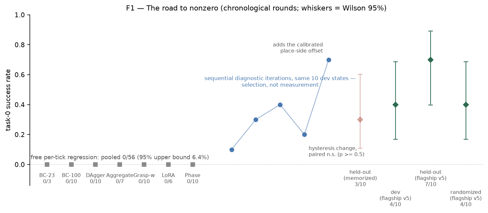
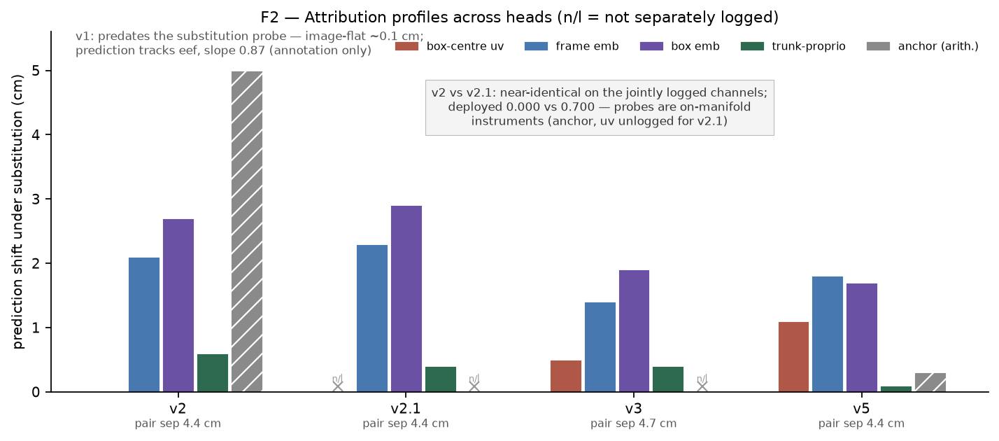
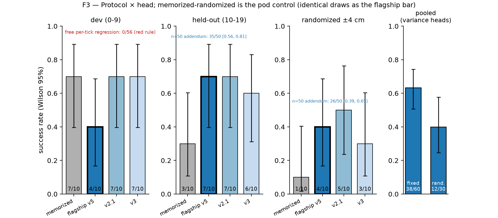
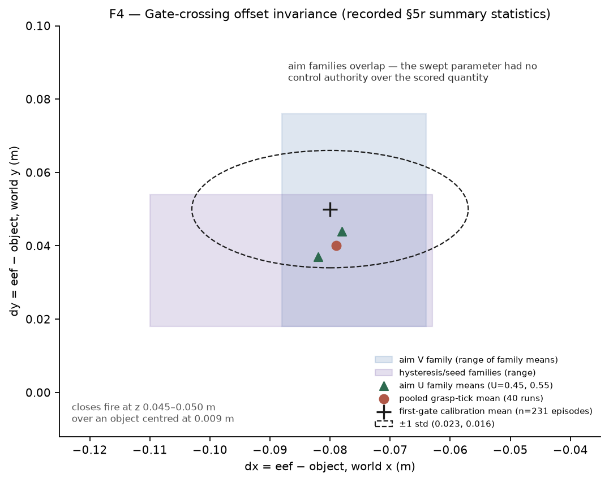

# Learning Location, Not Looking: A Placement-Memorization Audit and Ten-Episode Repair at the 30M Scale (MicroVLA)

**Manuscript draft v2 (2026-08-04; revised 2026-08-05: adds the
deployment-stack control cell, the audit-stack control trio, the n=50
dated addendum for both non-dev protocols, the post-rebuild re-measure
matrix, the released head's zero-shot sweep, the multi-object addendum
with its pre-registered fresh-seed confirmation, Table D.1, the rendered
figures, and references — App D).** Distilled from the full
experimental record
in `paper.md` (cited as log §*n*); every number is measured and traceable to that
log, `results/`, or `eval_results/`. Section 10 lists what this paper does *not*
claim; read it before quoting the abstract.

---

## Abstract

Fixed-placement benchmarks let imitation policies learn location instead of
looking. We document this on LIBERO-Object, whose target start poses are
exactly pinned (measured) in 6 of 10 tasks and within ~±1 cm in the rest.
First, an audit finds placement memorization at three layers: a calibrated
expert whose offset constant encodes pose (sign-flipping under a software
rebuild), an iteration-coupled selection loop (0.700 dev vs 0.300 held-out), and
a learned grasp head whose regression rationally prefers proprioception to
pixels. Second, a repair — ten teacher episodes under ±4 cm placement
teleports plus jitter on a nuisance input — restores grounding (attribution:
vision 1.1–1.8 cm, proprioception 0.1 cm), verified by a substitution probe
paired with a behavioural randomization protocol: the released head scores
0.400 dev, 0.700 held-out, 0.400 randomized (each k/10 with Wilson CIs in
§7; the held-out band carries five disclosed selection looks, §3; both
non-dev protocols confirmed at n=50 in the dated addendum — held-out
35/50 [0.56, 0.81], randomized 26/50 [0.39, 0.65], App D). The
protocol's twin control cells, added in this revision, scope that
verification from both sides: on the deployment stack, under identical
±4 cm shift draws, the memorized head scores 1/10 where the repaired
head's cell is 4/10 — randomization separates the heads behaviourally —
while on a rebuilt audit stack whose detector shift disables the repaired
head's visual goals (0/10), the shell's probe search absorbs the same
shifts for the proprioception-shortcut head (6/10 vs 3/10 unshifted): the
behavioural certificate is joint in (head, stack), and learned visual
competence is detector-stack-pinned (§7). Third, the
policy class that made this reachable is goal-structured decoding driving an
engineered pick-and-place shell; free per-tick regression scored 0/56. All
results are simulation (LIBERO/MuJoCo), one task and one object (task 0,
alphabet soup), n=10 per cell and final at that n; zero-shot on the other
nine tasks is 0.00 (n=3 each — memorized head, sibling v3, and the
released head itself; §7). A dated addendum carries the multi-object
campaign: a second object crossed and twice confirmed on never-scored
seeds, and two not crossed — with five pre-registered predictions recorded
and falsified and six instruments abandoned at their own calibration gates
before a sixth, needing no ground truth, succeeded and **retracted our own
proposed mechanism**: different objects' prompt chains select the *same*
detection from the same frame (median centre distance 0.0001), so deployed
role binding is **identity-blind**, and the crossing object's 35/50 is *not*
explained by binding the named object. This scopes "grounding" throughout —
the repaired head is grounded on *a* box, not *the named* one (App D).

---

## 1. Introduction

A policy that scores 0.700 on a manipulation benchmark has, on the face of it,
learned to see, decide, and act. This paper is about how much of such a number
can instead be *location*: constants — in a benchmark's init files, in an
expert's calibration, in a learned regressor's shortcut — that encode where the
object always is, so that vision only ever gates an approach a memorized value
finishes. On LIBERO-Object, we measure the preconditions exactly: the target
object's start pose is bit-identical across all 50 shipped init states in 6 of
10 tasks, and varies by only 0.25–0.58 cm (std) in the other four (§3). A
benchmark with ≲1 cm of target variance admits position-memorizers, and we
found them in every layer of our own system.

The vehicle is MicroVLA, a deliberately small language-conditioned
vision-language-action (VLA) stack: ~30 M parameters deployed, with a frozen
open-vocabulary detector serving as the only vision *and* text encoder (§2).
The size is the paper's setting, not its claim. Its methodological value is
that a stack this small has no capacity to paper over systems defects, so
every seam had to be instrumented — and the instruments are what this paper
contributes.

The arc: free per-tick action regression — behavioural cloning in seven
controlled variants spanning capacity, data aggregation, DAgger, input
adaptation, and objective redesign — scored 0/56 on the evaluated task, and
telemetry located the zero in quantities (a persistent goal, a phase
commitment, a hand-eye constant) that per-tick regression from single noisy
frames cannot represent (§4). Replacing the action head with two small heads
that predict *where* to grasp and place, driving an engineered pick-and-place
shell, broke the zero and climbed to 0.700 (§5). We then audited our own
number the way a sceptical reviewer would, found three layers of placement
memorization (§6), repaired the learned layer with ten variance episodes plus
one nuisance-input randomization, and verified the repair with an
input-substitution probe *paired with* a behavioural randomization protocol —
the pairing is load-bearing, because we also exhibit two heads whose probe
attributions are near-identical on every channel logged for both, yet deploy
at 0.000 and 0.700 (§6–7; one channel is unlogged for one head, and the
counterexample is scoped to the logged channels in §6). Running the protocol's
own missing control — twice, on two software stacks — then taught us its
sharpest lesson: on the deployment stack the memorized head collapses under
±4 cm randomization (1/10, its one success on the smallest draw) exactly
where the repaired head holds (4/10, identical shift draws), while on a
rebuilt audit stack whose detector shift disables visual goals, the
engineered shell's probe search absorbs the same shifts for the memorized
head (6/10; §7) — behavioural randomization certifies the head only jointly
with a stack on which visual goals are live; where they are not, it
certifies the policy bundle.

Structured decoding did not only lift the score; it made the failures
nameable. Because the shell's state is symbolic (phase, latched goal, attempt
index), every zero decomposes into a named mechanism in the telemetry rather
than a diffuse regression residual — which is what made a placement audit,
and then a targeted ten-episode repair, possible at all. §8 closes with the
instrumentation that the rest of the paper silently consumed: 29 defects at
producer/consumer seams, and the split between the ones parity testing can
catch and the ones only provenance can.

**Contributions.**

1. **A placement-memorization audit and its verification method.** A
   forensically worked instance of shortcut learning on a fixed-placement
   benchmark, shown at three layers — a calibrated teacher whose composite
   offset encodes pose (and detector version), an iteration-coupled selection
   loop, and a learned head whose regression rationally prefers
   proprioception — with the corrected, measured account of what
   LIBERO-Object actually pins (per-task table and shipped measurement
   script: App D); and the probe-plus-behavioural-randomization protocol,
   motivated by the on-manifold limit of substitution probes and by a
   counterexample to probe-only certification that is complete on the
   jointly logged probe channels and disclosed as unlogged on one (§6). The
   protocol's twin control cells (§7) sharpen its scope: behavioural
   randomization separates memorized from repaired heads under identical
   draws on the deployment stack (1/10 vs 4/10), and fails to separate
   them on a stack whose rebuild disables visual goals (6/10 vs 0/10) —
   the certificate is joint in (head, stack).
2. **A controlled policy-class result.** With perception, trunk, and corpus
   regime fixed, free per-tick regression scores 0/56 (upper 95% bound 6.4%)
   while goal-space supervision driving an engineered pick-and-place shell
   with local probe search scores 4/10 dev, 7/10 held-out, 4/10 under ±4 cm
   placement randomization (released head, n=10 per cell, final at that n;
   Wilson CIs in §7) — claimed strictly as a bundle (§5), and the shell's
   share of the bundle is measured on both stacks: on the audit stack the
   shell alone rescues even the memorized head under ±4 cm randomization
   (6/10), while on the deployment stack it cannot (1/10) — the learned
   share is what moves (§7).
3. **Training–serving-skew instrumentation.** 29 worked defect instances at
   producer/consumer seams, split into disagreements catchable by parity
   testing and agreements-on-a-wrong-convention catchable only by provenance
   (§8).

---

## 2. The platform in one page

MicroVLA targets CPU-class robot hardware (a Raspberry Pi 5 with a 7-servo
rig is the design context; no physical deployment is reported). The deployed
ledger:

| component | params | status |
|---|---|---|
| YOLO-World-S detector (vision + the *only* text encoder) | 13.0 M | frozen |
| Tiny Recursive Model (TRM) world model | 9.97 M | frozen at deployment |
| fusion + drift + relational + planner trunk heads | 7.0 M | trained (enforced ≤ 9 M cap) |
| goal heads (grasp 0.17 M + place 0.07 M) + learned gates (<3 K) | 0.24 M | trained |
| **deployed total** | **≈ 30 M** | |

No separate language model exists anywhere in the stack: the command is parsed
into source/target phrases, and CLIP embeddings for (command, source, target)
are harvested once per task from the detector's own text tower. The detector's
SPPF feature map (forward hook + ROIAlign) supplies a 512-d frame embedding and
per-role box embeddings; every embedding is standardized at the perception
boundary. The parameter caps are properties of the build, not of a table:
`microvla.utils.param_audit` and the test suite fail any violation. Across
training stages the total ever trained is ≈ 17.2 M (trunk 7.0 M + TRM ~10 M in
stage A, frozen thereafter, + 0.24 M goal heads); we report both numbers
because "trained" is stage-dependent.

Two sentences on the runtime, with a flag. A JEPA-style loop runs perception
at low rate and control at high rate, with intermediate ticks driven by the
TRM world model dreaming forward through the same fusion pathway as real
evidence, faded by a continuous confidence weight (App A gives the full loop,
schedule, and the training-inference alignment rule). **The world model is
causally inert in every nonzero number of this paper** — the goal heads that
produce all task success read the frozen detector's outputs directly (§4
quantifies the world model's own margins; §10 lists this under non-claims).

---

## 3. Benchmark, protocol, and what LIBERO-Object actually pins

**The pinning measurement.** On the pinned LIBERO commit (commit and init-file
hashes: App D), we measured the start pose of every task's target object
across all 50 shipped init states and under fresh seeded resets. Task 0's
alphabet-soup can starts at exactly (−0.120, −0.240), fixed quaternion, in
every init state. Across the suite, 6 of 10 targets are bit-identical across
all 50 states; the other four (bbq_sauce, butter, cream_cheese, milk) vary
with std 0.25–0.58 cm — roughly ±1 cm. The mechanism is specific, not
"degenerate regions": LIBERO's `TableRegionSampler` insets its sampling region
by the object's radius, and when that radius reaches 2.5 cm it collapses the
5×5 cm region to a point; each task's orientation is a single fixed
quaternion across all 50 states (the sampler pins rotation at π/2). The
basket's start position *does* vary across init states (measured std
0.8–1.0 cm per task, Table D.1; the demonstrations' recorded basket place
points spread wider, std ≈ (2.3, 1.5) cm — App B), as do 3 of 5 distractors;
a constant place point works anyway because the basket's aperture is much
larger than its variation. The varying init dimensions are arm and
distractor state. The thesis this sets up: ≲1 cm of target variance still
admits position-memorizers. Any prior evaluation that used these init files
inherits the same placement distribution; we make no inference about any
prior policy's visual grounding — detecting memorization took instruments
most evaluations have no reason to run — and we invite replication: the
instrument ships as `scripts/measure_placement_pinning.py`, which applies
every shipped init state through the eval harness's own `set_init_state`
call and emits the per-task table (reproduced as Table D.1, App D) with a
SHA-256 digest of each task's init-state array.

**Protocol.** All closed-loop results: LIBERO-Object task 0 (alphabet soup →
basket), MuJoCo, wrist camera only (`robot0_eye_in_hand_image`, 256 px),
perception period 2 (a real detector pass every 2nd control tick; the
design-target period of 15 appears only in App A; a period-1 control — real
perception every step — changed nothing: success 0.000, approach slightly
worse). Step cap 600, raised from 400 after two episodes timed out
mid-execution while holding the object. Determinism: trial *t* under base seed
*s* uses `trial_seed = s·1_000_003 + t`; the init state is
`init_states[trial_seed mod 50]`; placement teleports, when enabled, draw from
an RNG seeded `777_000 + trial_seed`. Reruns with identical code, weights,
flags, and seed reproduce trajectories on a fixed software stack (§6 shows
determinism does *not* survive a stack rebuild). Init-state bands: dev =
states 0–9 (seed 0), held-out = states 10–19 (seed 20), teacher calibration =
states 20–29 (seed 40); states 30–49 were never scored by any run until the
addendum's pre-registered confirmation drew from them (seed 77 → states
31–40; App D).

**Held-out reuse, disclosed.** The ten held-out states were never used in
training or constant-fitting, but they have been *scored* on five
selection-relevant occasions (pre-repair baseline, two sibling heads, the
flagship head, the gates-swap ablation). "Held-out" here means
never-in-training, reused across five selection looks; the n=50 campaign
(App D addendum) drew from the standard stream — ten of its states
coincide with this band, forty were never previously scored (disclosed
there).

**Comparability.** Community LIBERO protocols run 280/300 steps, 50 rollouts
per task, agentview + wrist observations; published sub-1B results reach
~87–90% under that regime (§9). No number here is comparable to those: 600
steps, n=10 per cell, wrist-only, scripted-expert corpora.

**Scoring.** An episode scores 1 iff the environment's success flag fires
within the step cap; every rate is reported as k/n with a Wilson 95%
interval, and no bare three-decimal rate appears without its counts.
Contrasts between two policies scored on the *same* init states are paired
by construction and are tested with the exact McNemar/sign test on
discordant pairs; Fisher's exact test (an independent-samples test) is
reserved for comparisons across different init-state bands (e.g. dev vs
held-out). Successful trials are auto-filmed from the wrist camera (App G).

**Instruments.** Instrument calibration is part of the protocol, because
across this project the instruments were wrong more often than the models. The
proximity metric everyone reads (`eef_obj_dist`) measures distance to the
object's *body origin*: demonstration replays put its value at gripper-close
at 0.040 m (range 0.009–0.066), not 0. Every proximity claim below is stated
against that reference. Even this calibration needed calibrating: pairing
demo *i* with eval init state *i* reproduced only 2 of 6 replays, because the
shipped init states are the evaluation set, not the demonstrations' — replay
from each demo's own recorded first state gives 5/6. Per-tick telemetry logs
end-effector state, detections, phase, and — for diagnosis only, barred from
every controller — simulator object positions.

---

## 4. The zero: free per-tick regression fails flat

The world model works; the policy's last centimetres do not. Under
deployment-matched rollouts on 20 held-out episodes (single training seed),
the TRM's `wm_margin` — the fractional reduction in next-frame-embedding
prediction error relative to a persistence baseline — is **+43.3% on the
moving wrist camera and −29.3% on the static agentview camera** in the same
generation of the stack; an earlier matched pair reads +1.7% (wrist) / −7.3%
(agentview) (log §4q, §5p; `eval_results/bench_v8_pod.json`). Sibling runs
bracket it: two arms sharing a stage A that OOM'd mid-ramp measured −46.8%,
and a 500-episode cold start +3.5% (App F). The honest reading: the world
model beats persistence only where the camera moves, loses where it is
static, and **contributes nothing to task success** — every nonzero number in
this paper is produced with the goal heads reading the frozen detector
directly, and removing dream ticks entirely left success at 0.000.

**The measurement problem.** Behavioural cloning with a free [5×7] per-tick
action head, on the same frozen perception, scored **0/56 pooled across seven
controlled rounds** (95% upper bound 6.4%): a 23→100-episode corpus scale
pair, a DAgger round, corpus aggregation, grasp-event reweighting, LoRA input
adaptation, and a phase-progress objective (task 0, wrist camera, perception
period 2, no assist flags; two cells truncated by infrastructure at 0/7 and
0/6 — full table, footnotes, and per-cell bounds in App C).

**What the zero is not.** Each alternative was a live hypothesis with a
killing measurement. Not grounding: auditing detection duty per candidate
view moved source grounding 0.219 → 0.850 and target 0.014 → 0.999 with zero
training, and detection duty during eval is 0.96. Not the dream path or the
corrector: both exonerated by ablation. Not scene clutter: removing every
distractor leaves success at 0. Not action magnitude, rate, or sign
conventions: measured, fixed, re-measured. Not the last-centimetre servo: a
40-run sweep over aim point, hysteresis, gains, and all eight
axis-flip/transpose image-to-world mappings never moved image error below
~0.20 — which was the clue. At n≤10 the per-cell zeros are individually
weak; the finding is the aggregate plus the telemetry signatures, which are
not weak:

* **Mean-collapse under partial observability.** The 100-episode student's
  lateral commands average |xy| = 0.025 raw units against the teacher's
  0.094–0.207 — a 4–8× undershoot. The teacher's final approach steers to a
  stored internal target invisible in any single frame, exactly where the
  detector is unreliable; regression to the conditional mean parks the arm.
* **The trigger is a class-imbalance event.** After the DAgger and aggregate
  rounds fixed approach and station-keeping (closest approach 0.061 m, final
  0.110 m — the policy stays on target), the residual isolated to the grasp
  trigger: the close occupies ~5% of corpus ticks and fires on ~1% of
  deployed ticks. Uniform BC underweights precisely the decision that
  completes the task.
* **A constant the controller cannot see.** Across a 40-run sweep atlas over
  aim point, hysteresis, gains, and all eight axis-flip/transpose
  image-to-world mappings, the end-effector at every grasp attempt sat a
  *constant* world-frame offset from the object — pooled mean
  (−0.079, +0.040, +0.023) m; at first gate crossing over 231 episodes, mean
  (−0.080, +0.050) m with std (0.023, 0.016) — invariant to the aim point
  (moving the aim ±0.10 in either image axis changed nothing), with closes
  firing at z ≈ 0.045–0.050 m over an object centred at 0.009 m. This is a
  camera-to-gripper lever arm: classical hand-eye calibration, absent, and
  unobservable to behavioural cloning against a wrist camera that never sees
  its own extrinsics.

A separately reported historical pool — 347 evaluations from earlier
generations, all zero — is excluded from the controlled count because those
checkpoints were independently certified incapable (emitted-action
`std_ratio` 0.26–0.42 against a measured [0.95, 1.05] necessity band; App C).

---

## 5. Goal-structured decoding and an engineered shell break the zero

**The bundle.** The claim of this section is deliberately conjunctive:
*goal-space supervision driving an engineered pick-and-place shell with local
probe search beats free per-tick regression at this scale.* We did not run
ablations that would apportion credit within the bundle (e.g. probe-retry
off), so no single component is claimed as the difference. Two control runs
after the fact scope what the bundle's randomized score can certify.
On the deployment stack, driving the same shell with the
placement-memorized head under the flagship's own ±4 cm shift draws scores
1/10 (§7) — there, the randomized column does separate a grounded head
from a memorized one. On the audit stack — where a detector rebuild
disables visual goals — the memorized head scores 6/10 under the same
protocol, no worse than its own unshifted 3/10 there (§7): with the ±6 cm
radius-ordered probe search downstream and vision inert, a ±4 cm
behavioural randomization certifies only the bundle.

**Learned part (0.24 M task-instance parameters atop an engineered
pick-and-place grammar).** A grasp-point head (0.17 M) regresses the world
grasp point from (source box uv/confidence/embedding, frame embedding,
proprioception); its label is the teacher's end-effector position at each
episode's final close onset — a label that contains the hand-eye lever arm by
construction. A place head (0.07 M) reads the basket point off the command
embedding; both carry heteroscedastic sigma from a detached-trunk variance
head (a joint-NLL collapse — mean stalling while sigma inflated — was
measured and designed out). Offline on the 111-episode fixed-placement corpus
(1,703 supervised ticks): val median grasp error ~1.3 cm, place error
0.85 cm, the place head's mean recovering the hand-calibrated basket constant
to ~6 mm.

**Engineered part, enumerated.** The shell (`GoalServoMachine`) is
task-instance-free but not task-free — it encodes the pick-and-place family:
sigma-gated one-way goal latching with first-descent refinement; a P-law
`clip(12·(goal − eef), 0.6)`; one-way phases with a debounced retry cycle; a
radius-ordered 2D probe search (±2/±4/±6 cm on both axes, 15 entries); an
unsigned-jaw hold check; a proprioceptive place leg with a lowered drop.
Trust gates evidence admission, never action magnitude, so parking is
impossible in this policy class. All of this stays engineered in every number
below.

**Diagnostic iterations, not a curve.** The first closed-loop evaluation of
the structured policy scored 1/10 — the first unaided success on record here
— and, unlike every free-regression zero, its nine failures isolated via
phase telemetry to two named structural defects (hover-altitude goal
latching; a probe search distributed along one axis against an isotropic
error), both fixed without retraining. Four further shell configurations
followed on the same ten dev states, each change diagnosed the same way:
1/10 → 3/10 → 4/10 → 2/10 → 7/10. These are selection iterations; we draw no
causal per-step conclusions. The one apparent
regression (4/10 → 2/10 after adding alignment hysteresis; same ten dev
states, so the contrast is paired — the exact sign test gives p ≥ 0.5 for
every discordant split consistent with these margins) is
consistent with noise and exposed a constant: the held object hangs a
near-constant (−2.8, +1.4) cm from the end-effector (fit over 390 transport
ticks, residual 3.3 mm), and the final configuration compensates with a
2-parameter place-side offset calibrated offline from logged rollouts — the
one calibrated task-adjacent constant in the 7/10 configuration, disclosed
wherever that number appears. The best zero-calibrated-constant figure is
0.400 (dev; memorized-era head; best of four zero-calibrated-constant
configurations).

**Staged shell replacement.** The shell's decisions are learnable from its
own traces: 30 self-play episodes with internal state dumped per tick
supervise two sub-3K-parameter classifiers replacing the close trigger
(accuracy 0.88 on 54 events, Wilson 95% [0.77, 0.94]; fire recall 0.89) and
the hold check (0.76 on 49 decisions, [0.62, 0.86]; recall 0.94). With both
gates learned, the held-out protocol scores 7/10 vs 7/10 for the hand-set
thresholds — no detected difference at n=10 (95% CI on the difference ≈
±0.40); we claim no measured cost at this n, not parity. The remaining
hand-set surface (latch stability, P-law gains, probe schedule, place
descent) is queued for the same trace-supervised recipe.

**The data engine is an assisted teacher, not a policy.** A phased
visual-servo machine — one visual fix from altitude, then proprioceptive
alignment, descent, probe retries, a proprioceptive place — whose constants
were derived offline from demonstration statistics *plus privileged
diagnostic telemetry* (simulator object positions) of calibration rollouts on
the same task, drawn from init-state bands disjoint from every scored band
and frozen during scored runs. Privilege reaches the unaided numbers in
exactly one place: none at evaluation (the deployed policy reads detections
and proprioception only), and eef-only labels at training (no simulator state
enters any label). Given the radius-ordered probe schedule, the teacher
completes ±4 cm-shifted picks at ~30% — which is what made the variance
corpus of §7 recordable. Its assisted results and mechanisms are confined to
App B and are never aggregated with policy numbers.

---

## 6. The audit: three layers of location-memorization

The 7/10 configuration reached 0.700 on the dev protocol. We audited that
number as a result in its own right, because every layer of the system turned
out to encode the benchmark's placement somewhere. Vision, in every layer of
this system's history, gated the approach; a memorized constant finished the
job.

**Layer 1 — the benchmark.** §3's measurement. Its training-side consequence:
a fixed-placement corpus cannot even *express* placement error — every val
label is the same point.

**Layer 2 — the selection loop.** The same policy scored 7/10 on the ten dev
states its five configurations were iterated against and 3/10 on the ten
held-out states (Fisher p≈0.18, n.s. at n=10). We initially read this as
machine-knob overfitting; the repair forced a sharper account. The gap later
closed with the machine constants *unchanged* (§7), so pure model selection
is insufficient — the measured mechanism is the head's dependence on an
off-manifold nuisance input (its own end-effector feature), isolated by the
one-variable jitter ablation below. Iteration-coupled selection and the
head's fragility were one defect wearing two hats. The governance consequence
was immediate: every leaderboard row has carried dev-vs-held-out annotations
since the gap was measured, and held-out is the citable column.

**Layer 3 — the teacher.** Under ±6 cm placement teleports the teacher's
visual approach still tracks the can to 5–7 cm at detection duty ≈1.0 — and
then its calibrated composite offset misses by approximately the shift. That
offset's −18.6 cm y-term encodes approach geometry, not hand-eye physics, and
its x-distributed probe cannot recover an isotropic error (2/2 unshifted vs
0/2 shifted, controlled A/B/C/D isolation, App B). The same constant failed a
*software-stack rebuild*: with identical code, weights, flags, and seed, the
re-measured offset's x-term flipped sign (+0.09 → −0.01), and the previously
2/2 configuration scored 0/2 (the score flip alone is n.s. at n=2; the sign
flip is the evidence). A constant that changes sign under a dependency bump
encodes the detector version too — the strongest form of the argument that
these quantities must be learned.

**The head, probed.** An input-substitution probe on the fixed-placement
grasp head: prediction flat (~1 mm) under image-position sweeps while
tracking the end-effector (slope ≈0.87 toward the fixed target). With a
constant label, the teacher's own converging approach makes proprioception a
better predictor than vision — the regression rationally
learns location, not looking. A tooling note that itself became method: the
first probe swept synthetic noise embeddings and was retired as
inconclusive-by-design (noise cannot distinguish "reads the frame" from
"memorized"); the upgraded probe substitutes *real* features between the two
most-separated recorded episodes and attributes the prediction shift per
input. The behavioural confirmations: 3/10 held-out, and 0.000 zero-shot
across all ten suite tasks (protocol: n=3 per task, seed 20 — the held-out
band — otherwise as §3; task 0 scored 0/3, which is consistent with this
head's own 0.300 held-out rate, P(0/3 | 0.3) = 0.34, so the sweep is
uninformative about task 0 specifically and is *not* used as a
placement-randomization control — §7 measures that cell directly on two
stacks, and the two measurements land on opposite sides of the inference
we would otherwise have drawn here: 1/10 on the deployment stack, 6/10 on
the audit stack).
One symmetric
disclosure: the place head regresses a basket position the benchmark holds
nearly fixed — layer-1 memorization by design, not probed or randomized here.

**The probe's limit is a first-class finding.** After the repair we held two
heads differing only by the nuisance-input jitter: on every channel logged
for both, their substitution attributions are near-identical
(trunk-proprioception 0.6 vs 0.4 cm; frame 2.1 vs 2.3 cm; box 2.7 vs
2.9 cm), yet they deploy at 0.000 and 0.700. One logging gap bounds the
claim: the reconstruction-anchor channel — v2's largest single attribution,
5.0 cm — and the uv channel were never separately logged for v2.1 (App F),
so the recorded evidence cannot exclude that a complete probe would separate
the pair on the anchor channel. The counterexample is therefore claimed as
"the logged probe channels did not separate them", not "no probe could".
The mechanism argument stands independently of that gap: substitution probes
evaluate *on-manifold* (both probe episodes are teacher trajectories); the
deployed machine visits off-manifold states (hover, rise, probe cycles),
where the un-jittered head's eef-feature pathway extrapolates unstably.
Attribution alone certifies what a head reads, not how it fails
off-manifold. This scoped counterexample, plus the on-manifold limit itself,
is why we propose the pair — substitution probe *plus* behavioural
randomization protocol — rather than the probe as practice. The twin
control cells of §7 then bound the *behavioural* half symmetrically:
on a stack where visual goals are live, ±4 cm randomization separates a
grounded head from a memorized one (1/10 vs 4/10, identical draws); on a
stack where they are dead, the same radius — inside this shell's ±6 cm
probe schedule — certifies the policy bundle, not the head.

---

## 7. The repair: ten variance episodes plus nuisance-input randomization

**The corpus.** Ten teacher episodes recorded under ±4 cm source-pose
teleportation (recording bands disjoint from all scored bands; teleports
drawn per §3's RNG) replace the fixed-placement corpus; consolidations at 27
and 49 episodes followed. On placement-varied labels the heads reach val
median 1.23 cm (10 ep), 0.99 cm (27 ep), 1.85 cm (49 ep, wider ±5 cm shifts).

**The augmentation, named.** Training-time jitter on the end-effector
*feature* the trunk sees (`--eef-jitter 0.08`), while the reconstruction
anchor stays exact — nuisance-input randomization in the lineage of
ego-motion dropout and copycat mitigations (§9), i.e. domain randomization
over a nuisance input. The delta worth stating is which input and what is
held fixed: the trunk-visible feature is randomized while the label
arithmetic stays honest. A one-variable behavioural ablation isolates it —
identical ten-episode corpus, identical shell, jitter the only change,
scored on the same ten dev states, so the design is paired:
**0/10 → 7/10 dev; 7 discordant pairs, all favouring jitter; exact
McNemar/sign test p≈0.016** — the campaign's one significant contrast. (An
earlier draft quoted Fisher p≈0.003 here; Fisher assumes independent
groups and is inapplicable to this paired design.)

**Flagship and siblings.** Sibling policy, stated once: the flagship is the
released checkpoint `models/goal_heads_v5.pt` (49-episode corpus); the two
earlier variance-trained heads are reported as labelled sibling rows, are not
in the release, and never headline. All cells k/10 with Wilson 95% CIs; task
0, wrist camera, perception period 2:

| protocol | memorized head (111-ep fixed corpus) | **flagship v5 (released)** | sibling v2.1 (10 ep) | sibling v3 (27 ep) |
|---|---|---|---|---|
| dev (states 0–9) | 7/10 [0.40, 0.89] | 4/10 [0.17, 0.69] | 7/10 [0.40, 0.89] | 7/10 [0.40, 0.89] |
| held-out (states 10–19) | 3/10 [0.11, 0.60] | **7/10 [0.40, 0.89]** | 7/10 [0.40, 0.89] | 6/10 [0.31, 0.83] |
| randomized ±4 cm (pod, identical draws) | **1/10 [0.02, 0.40]** ‡ | **4/10 [0.17, 0.69]** | 5/10 [0.24, 0.76] | 3/10 [0.11, 0.60] |
| randomized ±4 cm (audit stack) | 6/10 [0.31, 0.83] † | 0/10 [0.00, 0.28] † | — | — |

Row provenance: memorized and sibling cells predate the 2026-08-04 pod
stack rebuild; flagship cells are post-rebuild (held-out additionally
confirmed at n=50, and the randomized cell's draw sequence replicated
exactly the night of the control run). Post-rebuild re-measures are dated
App-D cells, kept out of this table by the same rule that keeps
audit-stack cells out — and they carry §6's sharpest behavioural fact:
the memorized head's dev cell collapses across the rebuild (7/10 → 2/10,
its held-out floor) while the repaired head's cells reproduce.

‡ Pod-stack control cell, run 2026-08-05
(`libero_object_real_1785905093901`): the memorized head under the same
seed as the flagship's randomized cell, which drives the identical
shift-draw sequence (verified line-by-line in the run logs). Its single
success is the smallest-norm draw, (−0.2, −1.4) cm — the object nearly at
its memorized location. Per-trial pairing against the flagship on the same
draws gives discordants b=3 (flagship-only successes), c=0 (exact sign
p=0.25, n.s. at n=10; the direction is uniform).

† Audit-stack control cells, run 2026-08-04 on a second stack — the
macOS audit stack (App D) — because §6 shows behaviour does not survive
stack rebuilds unexamined; they are never compared numerically
against this table's pod-stack cells. Two same-stack anchors calibrate
them: the identical memorized configuration *unshifted* on the same states
scores 3/10 on the audit stack (exactly its pod held-out number — the
proprio-dominant pathway reproduces across the rebuild), and the released
flagship under the identical randomized protocol and shift draws scores
**0/10** there (4/10 pod; the telemetry is not ambiguous: detection duty
0.92 with mean closest approach 0.111 m, vs 0.025 m for the memorized
policy under the same draws — the learned *visual* goals are what the
rebuild moved, §6's stack finding recurring at the learned layer).

Pooled, inclusion rule: all three variance-trained heads, every scored
pod-stack cell,
n=10 each, no exclusions — fixed-placement (dev + held-out) **38/60 = 0.633
[0.51, 0.74]**; randomized **12/30 = 0.400 [0.25, 0.58]**. The audit-stack
control cells are excluded from every pool by the cross-stack rule above.
These recomputed pools supersede a previously reported 24/40,
which is not reconstructible from the per-cell record. The three trios are
statistically indistinguishable at n=10; corpus scaling 10 → 27 → 49
sharpened attribution, not scores.

**What the repair shows — measured by its own controls, on two stacks.**
Earlier drafts read the randomized column as "the first moved-object
successes", excused the missing memorized cell by its probe and an n=3
zero-shot (a cell that is statistically empty: under the memorized head's
own 0.300 held-out rate, 0/3 occurs 34% of the time), and treated the
column as the behavioural certificate of de-memorization. The two controls
sharpen that reading rather than settling it one way. On the deployment
stack, under the flagship's own shift draws, the memorized policy scores
1/10 where the flagship's cell on the identical draws is 4/10, and its
single success is the draw that barely moved the object (norm 1.4 cm):
there, the behavioural column reads as a de-memorization certificate. (We
state the deployment-stack contrast head-vs-head on identical draws only:
the unshifted dev baselines in the table predate the 2026-08-04 stack
rebuild, and §6 forbids charging a cross-stack difference to
randomization. The post-rebuild re-measure makes that discipline pay: the
memorized head's dev cell does not survive the rebuild — **2/10**
unshifted on the current stack (`libero_object_real_1785908164575`,
App D; detection duty 0.98, closest approach 0.035 m — the shell still
finds the object) against 7/10 pre-rebuild, landing at its own held-out
floor (3/10) — while the repaired head's cells reproduce across the same
rebuild (held-out 0.70 re-confirmed at n=50; randomized 4/10 replicated
on identical draws). The 7/10 dev number was never the head's; it
belonged to the (head, stack, selection-loop) tuple — §3's layer-2
iteration coupling, measured behaviourally. Memorization is
stack-coupled; grounding is what survived the rebuild.) On the audit stack — where the
detector rebuild disables the flagship's visual goals (0/10) — the same
memorized policy scores 6/10 randomized against its own 3/10 unshifted
(per-trial pairing over the same states: discordants b=1, c=4, exact sign
p≈0.375): with vision inert, ±4 cm sits inside the shell's ±6 cm
radius-ordered probe search and randomization costs the memorized policy
nothing. Three consequences, stated plainly. (1) The ±4 cm behavioural
column certifies the head *jointly with the stack*: it separates memorized
from repaired heads where visual goals are live, and certifies only the
bundle where they are not; a stack-free head-level behavioural certificate
needs randomization beyond the shell's search envelope, or the head probed
with the shell off — both are in the pre-registered follow-up (App D).
(2) "First moved-object successes" was chronology on the audit stack and
capability on the deployment stack: the memorized policy, once offered the
protocol where vision works, could not follow the object. (3) The
stack-independent certificate of the repair remains head-space evidence:
the attribution shift (v1 image-flat and
eef-tracking → v5 vision-dominant: anchor arithmetic 0.3 cm,
trunk-proprioception 0.1 cm, vision channels uv 1.1 + frame 1.8 + box
1.7 cm on a 4.4 cm label pair — with the box centre informative for the
first time in any head), validation error measured on placement-varied
labels (a quantity the fixed-placement corpus cannot even express), and the
paired jitter ablation (0/10 → 7/10 dev, exact McNemar/sign p≈0.016). The
dev/held-out gap remains *consistent with closing*
(3/10 → 7/10 across the memorized-to-flagship pair on the same held-out
states; n.s. — exact sign test p in [0.125, 0.344] over all discordant
splits consistent with the margins). And the flagship's audit-stack 0/10
adds the campaign's most uncomfortable sentence: a head certified
scene-reading on one stack reads *that stack's* scene — visual grounding
bought detector-version dependence, which the proprio-shortcut head never
had.

**Transfer boundary.** Placement generalization repaired; object
generalization measured at its boundary, crossed for one further object
and blocked at a named stage for a third — both in the dated addendum. Under the all-tasks sweep — run first with sibling v3
(protocol as in §6: n=3 per task, seed 20, otherwise §3) — a
variance-trained head scores 0.67 on task 0 (2/3 [0.21, 0.94], consistent
with held-out) and 0.00 on tasks 1–9 (n=3 each) — the corpus is soup-only.
The released flagship's own sweep (run 2026-08-05, n=3 per task, seed 20,
`libero_object_real_1785913852707`) reproduces the sibling's shape
exactly: task 0 at 2/3, tasks 1–9 all 0/3 — 0.067 overall, detection duty
0.997 with mean closest approach 0.140 m on the misses: the detector sees
the novel objects; the grasp head has no goals for them.
The boundary's mechanism was itself worth auditing, and the audit
overturned our first reading of it. The butter teacher converges to
0.000–0.009 m of the object at detection duty 1.0, closes at 0.67 duty,
and never lifts at *any* hold threshold (0.2 → 0.06, byte-identical
episodes) — which we first read as a failed grasp *strategy*. An
instrumented re-run (audit stack) measured the actual mechanism: a
consistent ~5 cm residual along the jaw-capture axis at every close onset
(the calibration loop had iterated a fixed two rounds with a success-only
exit, and "0.000–0.009 m" is episode-min 3D distance — a descent flyby
that masks the at-close jaw-axis component). The residual's failure
signature is asymmetric-contact squeeze-out: one finger jams open on the
slab while the other sweeps it 1.0–1.6 cm out of the closing gap — no
hold threshold can score a grip that ejected its object. One
recalibration from the measured at-close residual produced a centered
close, zero object drift, and the campaign's first butter lift (grip held
150+ ticks; that episode still scores 0 because the audit stack never
detects the *basket*, §6's stack finding at the place leg). The boundary
therefore re-scopes from "needs a per-object grasp strategy" to "needs a
*converged per-object offset*" — per-object constants after all, carrying
the same stack-pinning §6 measured for the soup offset. (A second omission
completed the re-diagnosis on the deployment stack: the butter recording
chains never passed the teacher's calibrated place point, so every
otherwise-sound episode timed out hunting an undetectable basket —
tgt detection duty 0.0 through entire transports on both stacks, object
held to z = 0.7. With the same place constant every soup chain used, the
butter teacher goes end-to-end at 2/3.) The multi-object campaign this
re-diagnosis unblocked then ran to a mechanism-complete result the same
day, reported as dated App-D addendum cells and not amended into this
paper's numbers. Its short arc is this paper's thesis in miniature: a
26-episode butter corpus trains a head that is *clean on every offline
instrument* (labels tight, on-manifold error 1.3 cm, no proprio leaning,
hover estimates accurate) and deploys at 0/10 with 5–15 cm goal error —
live instrumentation then catches the estimate stream *walking* +10 cm as
the approach controller chases it, because the teacher pins the object at
a fixed image position during approach and the machine does not, so the
machine's own motion drives uv off the training manifold (§6's
on-manifold probe limit, with a feedback loop attached). Latching from
the far-view estimates and freezing flips butter 0/10 → 10/10 with no
retraining — and drops soup to 1/10, whose coarse hover estimates need
exactly the refinement that poisons butter; the head's calibrated sigma
cannot arbitrate (0.007–0.017 live in both regimes). One config serves
both: an anchor trust-region (admit estimates only within 4 cm of the
first stable far-view median — refinement passes, the chase is rejected)
scores butter 6/10 and soup 4/10 under a single policy bundle with no
per-object constants. Config looks accumulated on one state band are
disclosed in App D; the pre-registered single-shot confirmation on a
never-scored seed returned 5/10 butter + 3/10 soup — consistent with the
selection-band cells, at the modest rates its small n states (App D).

**Negatives and calibration honesty.** Joint LoRA adaptation of the
embedding stage hurts at this corpus scale (val 3.08 vs 0.99 cm). A
machine-gate parameter sweep on the randomized protocol is flat (0.400
baseline; stricter admission 0.400; looser + more votes 0.300; longer probe
0.400): the tail is goal-accuracy-bound, and the shell is not knife-edge
tuned. The heads' sigma is mildly overconfident (empirical coverage
0.559–0.782 across the three heads against nominal), a stated next lever
rather than a hidden one. Successes across the table were filmed at run time;
the release ships three representative films plus the App G manifest.

Summarizing the section in one sentence: ten episodes of label variance and
one nuisance-input augmentation produced a head that reads the scene by
every logged head-space measure — while the section's own control cell
shows that at ±4 cm the engineered shell can hide the difference
behaviourally, and the audit-stack anchor shows that "reads the scene"
means reads the scene *as this detector stack renders it*.

---

## 8. Producer/consumer defects as training–serving skew

Everything above was reachable only because the seams were instrumented. The
project logged **29 defects** at producer/consumer boundaries, each with its
discovery measurement and the cheaper instrument that would have caught it
earlier (App E). The taxonomy's boundary is the finding: **24 disagreements**
(class 1) — producer and consumer of a feature corpus differ on units, rates,
defaults, camera or index conventions — are catchable by *parity testing*
(run both paths on one input, diff tensors). **5 agreements on a wrong
convention** (class 2) — both sides consistent, both wrong — are invisible to
parity by construction
and fall only to *provenance*: corpora that describe themselves
(`manifest.json` records camera, orientation, thresholds, rates, geometry),
with eval refusing silently mismatched inputs. Both instruments ship in the
release (`eval/train_vs_deploy.py`; manifest refusal in the corpus loaders).
Parity has a second limit worth naming: our parity harness forced real
perception every tick, which is exactly why a deployment-only code path
stayed invisible to it.

| class | instance | catch instrument |
|---|---|---|
| convention agreement | mirrored-jaw sign: held-object check read a signed mean ≡ 0 in every jaw state | one logged measurement (boxed below) |
| corpus provenance | corpus baked from a camera in which the detector is blind: target role grounded on 1.4% of 38,000 frames | manifest + duty audit |
| rate/schedule skew | one world-model step ≈ 10 env steps, applied every step | deployment-path diff |
| deployment-only state | a real-tick detection miss silently held stale evidence | live-loop telemetry (parity-blind) |
| split-brain threshold | the detector threshold was two numbers (bake vs eval) | self-describing corpora |
| consumer floor above signal | confidence floor 0.10 above an object's real 0.03–0.09 detection band | per-tick believed-vs-raw logging |

> **The exemplar.** A probe-retry controller walked the gripper to 4 mm from
> the object's centre, at its exact height, with the object between the
> fingers on any closing axis — and the held-object check still read "air".
> That impossibility was the finding. The check averaged the two finger
> joints, and the panda's fingers are mirrored, `(+q, −q)`: the signed mean
> is identically zero in every jaw state (measured: open (+0.906, −0.906) →
> 0.0001; holding the box (+0.552, −0.689) → −0.069; unsigned mean 0.91 vs
> 0.62, cleanly separable). Every physically successful grasp the project had
> ever produced was discarded by this line, one tick before lift. The test
> mocks encoded the same same-sign misunderstanding, so tests passed and no
> parity test could disagree. One `abs()`, in two state machines, was the
> entire fix.

We believe this instrumentation, not the architecture, is the transferable
half of the paper: every frozen-encoder stack has these seams, and agreement
is not correctness.

---

## 9. Related work

**Scale and size.** RT-2 (~55 B) and OpenVLA (~7 B) established VLM-to-action
fine-tuning; Octo, TinyVLA, and SmolVLA compress the recipe. Sizes are
comparable only under one stated convention — here, *deployed* = every
parameter loaded at inference, frozen or trained:

**Both conventions, because they disagree.** An earlier draft of this table
listed Octo-small as the smallest alternative and omitted **RT-1 (35 M)**, the
nearest neighbour in size — a material omission, corrected here. The two size
conventions in common use disagree about who is smallest, because published
counts routinely exclude a frozen language encoder that inference still loads:

| stack | trained | deployed | language encoder |
|---|---|---|---|
| RT-2 | 55 B | 55 B | internal (PaLI-X) |
| OpenVLA | 7 B | 7 B | internal (Llama-2) |
| SmolVLA | 450 M | 450 M | internal (SmolVLM2) |
| TinyVLA family | ~70 M backbone – 1.4 B | ~70 M – 1.4 B | internal |
| LiteVLA (arXiv 2511.05642) | LoRA only | ~256 M | internal (SmolVLM-256M) |
| NanoVLA-S (arXiv 2510.25122) | 52 M | ~161 M | BERT-base, frozen, **excluded from its headline** |
| Octo-small | **27 M** | 138 M | T5-base, 111 M frozen |
| RT-1 | 35 M | **≥35 M** | USE, frozen, *uncounted* |
| **MicroVLA (this work)** | **17.2 M** | **30.2 M** | *none* — detector's own tower |

MicroVLA counts from `microvla.utils.param_audit`: trunk 7,005,837 + goal heads
0.24 M + TRM 9.97 M = 17.2 M trained; + 13.0 M frozen detector = 30.2 M
deployed. Only **7.24 M is causally load-bearing** (the world model is inert in
every nonzero number).

MicroVLA is the smallest of the surveyed systems **under both conventions at
once** — 1.6× below Octo-small's 27 M trained, and below RT-1's 35 M deployed
*even after granting RT-1 a free language encoder*, for which we deliberately
cite no count rather than estimate one. The claim is bounded and refutable: it
ranges over surveyed language-conditioned VLA policies with published counts,
concerns parameter counts alone, and is refuted by exhibiting any
surveyed-class system below 17.2 M trained or 30.2 M deployed. We do not claim
smaller systems cannot exist, and we do not claim small size *caused* any
success rate reported here. The mechanism is architectural: MicroVLA carries no
separate language model, so the frozen encoder the other rows pay for twice —
once in memory, once in the convention mismatch — does not exist here.

**The survey was run adversarially**, searching specifically for systems
*smaller* than ours and reading the two live threats rather than trusting
search summaries. NanoVLA is the convention gap in miniature: a paper named for
being nano reports 52 M while loading ~161 M, because a frozen ResNet18 and a
frozen BERT-base do not appear in the headline (its "98% fewer parameters" is
measured against OpenVLA's 7.5 B, not against small systems). LiteVLA reaches a
Raspberry Pi on a 256 M SmolVLM backbone. Both sit above MicroVLA on both axes.
The USE parameter count stays deliberately uncited — no authoritative figure
was found, and RT-1 is granted its best case instead.

On absolute performance: sub-1B systems report ~87% on
LIBERO-Object (CoTinyVLA) and ~90% suite averages (XS-VLA); SmolVLA ~83% —
under the community protocol and end-to-end fine-tuning on large
demonstration corpora. §3 states why nothing here is comparable to those
numbers. Data provenance per result, for the same reason: the historical
free-regression pool trained on the suite's 50 human demonstrations per task;
the seven controlled rounds behaviour-cloned scripted-teacher corpora
(23–140 episodes); the structured heads trained on scripted-expert corpora
only (111 fixed-placement episodes, then 10/27/49 teleport-variance episodes
recorded at ~30% teacher success). No comparison in this paper is on a
demonstrations-per-task axis.

**Shortcut learning and causal confusion.** Our audit is a worked
manipulation instance of a documented family: causal confusion in imitation
(de Haan et al. 2019), the copycat problem (Wen et al. 2020), ego-motion
shortcuts and their dropout mitigations (ChauffeurNet, Bansal et al. 2018),
shortcut learning generally (Geirhos et al. 2020), and robomimic's
observation-space ablations (Mandlekar et al. 2021). Input-substitution
probes are standard in that literature; what we add is the audited
counterexample (near-identical attributions on the jointly logged channels,
0.000 vs 0.700 deployed — §6 discloses the one unlogged channel), the
resulting probe-plus-behavioural-randomization pairing for fixed-placement
benchmarks, and the twin control cells that scope the pairing itself:
behavioural randomization separates memorized from grounded heads only on
a stack where visual goals are live; where they are not, the controller's
own search envelope absorbs the randomization (§7).

**Structured action interfaces.** Predicting *where* rather than *how* is the
Transporter Networks (Zeng et al. 2020) and CLIPort (Shridhar et al. 2021)
lineage, continued by keypoint/point interfaces over engineered primitives
(MOKA; VoxPoser; RoboPoint; PIVOT) and, with both levels learned, π0.5. Our
synthesis delta is narrow and stated as measured: inside a 30 M stack, with
trunk and corpus regime fixed, the goal-decoding-plus-engineered-shell bundle
scores where free per-tick regression pooled 0/56 — a controlled comparison
at one scale, not a claim about decoding in general. π0.5's hierarchical
inference validates the same decompose-what-from-how thesis with both levels
learned at frontier scale; we read the two results as ends of one curve — as
capacity shrinks, the motor level becomes structure — with the staged shell
replacement of §5 as our path back toward the learned end.

**Scripted experts and distillation.** Bootstrapping policies from scripted
or generated experts is established (MimicGen, Mandlekar et al. 2023; Ha et
al. 2023). Our delta is the closed audit loop: the scripted teacher itself
was audited, caught encoding placement and detector version, and repaired —
the data engine is inside the experiment, not upstream of it.

**ML systems engineering.** §8 instantiates hidden technical debt (Sculley et
al. 2015) and ML test-score practice (Breck et al. 2017); the
manifest-refusal pattern is a pseudo-oracle (Weyuker 1982) for corpora.
Visual servoing and hand-eye calibration are classical; §4's lever arm is,
knowingly, a rediscovery with modern telemetry. The JEPA-style loop follows
predictive world-model lines; its alignment rule is App A material.

---

## 10. Claims, non-claims, limitations

**Claimed.** (1) The §3 pinning measurement, in its scoped form, with the
per-task table and shipped measurement script (App D). (2) On
LIBERO-Object task 0 (alphabet soup; simulation; wrist camera; perception
period 2), the released flagship head (`models/goal_heads_v5.pt`) driving the
engineered shell scores 4/10 dev [0.17, 0.69], **7/10 held-out [0.40,
0.89]**, and **4/10 under ±4 cm placement randomization [0.17, 0.69]** —
n=10 per cell, final at that n, with both non-dev protocols confirmed at
n=50 in the dated App-D addendum (held-out 35/50 [0.56, 0.81]; randomized
26/50 [0.39, 0.65]); the held-out band carries five disclosed selection
looks (§3), and the randomized column certifies the head jointly with the
stack (§7's twin control cells: on this stack the memorized head with the
same shell scores 1/10 under the identical draws; on the audit stack,
where visual goals are dead, 6/10 — the probe envelope absorbs ±4 cm only
when vision is inert). These cells are
additionally stack-pinned: on the audit stack the flagship's randomized
cell does not reproduce (0/10, healthy detection duty — §7, App D), so
claim (2) holds on the §11-pinned stack and is not claimed to transfer
across detector-stack rebuilds. Zero-shot on the other nine tasks is 0.00
(n=3 each), measured with the memorized head (§6), sibling v3 (§7), and —
added in this revision — the released v5 itself (task 0 at 2/3, tasks 1–9
all 0/3; App D): the soup-only corpus bounds the head, not the detector.
(3)
Free per-tick regression under the same frozen perception and corpus regime:
0/56 (upper bound 6.4%). (4) The de-memorization mechanism at the head
level: the attribution shift and label-space evidence of §6–7, and the
one-variable jitter ablation (0/10 → 7/10 dev, paired, exact McNemar/sign
p≈0.016) — plus the behavioural separation on the deployment stack (1/10
memorized vs 4/10 flagship, identical draws), scoped by the audit-stack
control, which shows the separation vanishes on a stack where visual goals
are dead. (5) 29
worked skew defects with the parity/provenance split. The pre-repair 0.700
dev / 0.300 held-out pair is retained only as the audited baseline.

**Not claimed.**

* Any task-success contribution from the world model: it is causally inert in
  every nonzero number; its prediction margins are camera-scoped (§4) and are
  not a contribution.
* End-to-end learned motor control: the shell is engineered
  (task-instance-free, pick-and-place family); the staged replacement of its
  gates shows no detected difference at n=10, nothing stronger.
* Generalization beyond the stated cells: dev numbers are selection-coupled
  by construction; the dev/held-out gap closure is "consistent with" (paired
  on the same held-out states; n.s. — exact sign test p in [0.125, 0.344]
  over all discordant splits consistent with the margins), not settled.
* Head-level placement grounding *from the randomized column alone,
  stack-free*: the audit-stack control shows the shell's probe search
  recovers ±4 cm shifts even for the memorized head when visual goals are
  dead, so the behavioural column certifies the head only jointly with a
  stack on which vision is live — on the deployment stack it does separate
  the heads (1/10 vs 4/10), and §6–7 carry the stack-independent claim via
  attributions and varied-label validation.
* Object-level generalization: one object in every claimed cell of the
  body. Four objects were attempted and two are carried in the dated
  App-D addendum — the
  campaign runs from teacher end-to-end (2/3), through a head clean on
  every offline instrument yet 0/10 deployed, to the live-caught
  estimate-chase mechanism, to 10/10 butter under early latch
  (config-split), to 6/10 butter + 4/10 soup under one anchor-band config
  with no per-object constants, with two pre-registered fresh-seed
  confirmations (5/10 + 3/10, and 5/10 + 4/10 on a three-object head).
  Two further objects (cream cheese, chocolate pudding) do NOT cross:
  goals are accurate where measurable (cream 1.58 cm on-manifold against
  butter's 1.34) but role binding fails identically on both, and a
  four-binder study shows the failure is not liftable by any
  corpus-derived binder — offline binder accuracy dissociates from
  deployed success (§7). The deployed binding accuracy that would
  quantify this is reported as unmeasured: six instruments were built to
  measure it and all six failed their own pre-registered calibration
  gates; a seventh, needing no ground truth, succeeded (App D.0). No multi-object number is claimed in the body; the addendum
  carries them with their
  selection ledger, their falsified prediction, and the open experiment.
* Assisted-teacher numbers as policy competence (App B only).
* Any comparative size superlative; any comparability to community-protocol
  LIBERO scores (§3, §9).
* Physical deployment: simulation only; the Pi 5 rig is design context.
* "Every success filmed" as a release property: successes were recorded
  during runs; the release ships three representative films plus a manifest
  (App G).

**Limitations.** n=10 per cell — every claim here is final at its stated
n; the pre-registered n=50 campaign landed 2026-08-05 as the dated App-D
addendum (held-out 35/50 [0.56, 0.81]; randomized 26/50 [0.39, 0.65]; one
disclosed protocol deviation on state freshness) without amending this
paper's numbers. Ten held-out
states reused across five selection looks; machine
constants inherited from the dev-tuned era (their unchanged-ness is part of
the layer-2 evidence, but they are not innocent); substitution probes are
on-manifold instruments (§6); ±4 cm behavioural randomization is inside the
shell's ±6 cm probe envelope and separates heads only where visual goals
are live (§7); the audit-stack control trio was run on a second software
stack (macOS audit stack, disclosed in §7 and App D — §6's stack-rebuild
finding is why cross-stack cells are never pooled), and the pod control
cell shares the deployment stack but was run once, n=10, without
per-parameter tuning; the teacher's calibration consumed privileged
diagnostic telemetry offline (§5); single benchmark, single simulator.

---

## 11. Reproducibility

**Start here: `paper/submission/REPRODUCE.md`** carries the exact commands for
both n=50 headline cells, the md5 hashes of the two checkpoints that produced
them (`goal_heads_v5.pt` `01ff8728…`, `full_stageB_rec_fix.pt` `a8ea1cda…`,
verified byte-identical between this repo and the machine that ran them), and a
`--mock-env` smoke test needing no LIBERO, no GPU, and no network. It also
states what reproduction means here: **land inside the Wilson interval, not on
the point estimate** — these are Bernoulli cells, and a rerun hitting 0.700
exactly would be luck rather than fidelity. And it warns that a mismatch on a
*different* software stack may be this paper's own audit-stack finding
recurring rather than a failed reproduction, so stack versions should be
reported with any discrepancy.

Run artifacts are now self-describing: `results.json` records `provenance`
(full `argv`, git commit, dirty flag). The two headline artifacts **predate**
this field — their commands had to be recovered from the shell scripts that
launched them, which is precisely why the field now exists.

One repo; every dimension flows from one config object; 606 tests (CPU-only,
mock-only, no network) cover the deployment path; parameter and disk budgets
are asserted by the build. Shipped: `models/full_stageB_rec_fix.pt` (trunk),
`models/goal_heads_v5.pt` (flagship), `models/goal_heads_v7.pt` (the
addendum's multi-object head), `models/gates_v1.pt` (learned gates),
`data/libero_object_grid/norm_stats.json`,
`scripts/measure_placement_pinning.py` with its emitted
`results/placement_pinning.{md,json}` (Table D.1),
`results/UNAIDED_LEADERBOARD.md` (regenerated 2026-08-05 to the full
record — flagship n=50 confirmations, both control cells, the rebuild
matrix, and the multi-object addendum; where any residual disagreement
surfaces, the §7 table and App D are authoritative),
`paper/render_results_figs.py` (re-renders F3 from the table) and
`scripts/collect_tonight.py` (re-verifies every addendum cell against its
results JSON),
sibling weights and per-round results/telemetry under `results_backup/`,
three representative films plus the App G manifest, and the full experimental
log `paper.md` including every negative result and retraction. Canonical
commands:

```
python -m pytest tests -q                        # 606 tests, no sim deps
python -m eval.bench --checkpoint none --synthetic 30
python -m eval.libero_eval --suite libero_object --task-ids 0 \
  --checkpoint models/full_stageB_rec_fix.pt --goal-ckpt models/goal_heads_v5.pt \
  --camera robot0_eye_in_hand_image --render-size 256 --perception-period 2 \
  --max-steps 600 --n-trials 10 --seed 20          # held-out cell
# randomized cell: add --randomize-source-xy 0.04
# gates swap: add --gates-ckpt models/gates_v1.pt
# memorized-head control cells (§7): swap --goal-ckpt for
#   results_backup/weights/goal_heads_v10_goal3_goal4.pt
#   and pass --goal-kwargs '{"hang_comp": [-0.028, 0.014]}'
python scripts/measure_placement_pinning.py --suite libero_object   # Table D.1
python train/train_goal.py --data-dir <variance shards> --eef-jitter 0.08
python train/train_gates.py --data-dir <self-play sidecars>
```

Environment pins (evaluated stack): Python 3.10, torch 2.8/cu128, torchvision
0.23, mujoco 2.3.7, robosuite 1.4.1, LIBERO from source at the pinned commit.
The release manifest (`models/README.md`) records the LIBERO commit SHA,
init-file hashes, the ultralytics version, SHA-256 digests for the detector
and every `models/*.pt`, the exact training commands, and a
file → log-name → leaderboard-row → paper-section crosswalk; results JSONs
embed `vars(args)`, the git SHA, and model hashes (App D).

---

## References

* Bansal, M., Krizhevsky, A., Ogale, A. (2018). ChauffeurNet: Learning to
  Drive by Imitating the Best and Synthesizing the Worst. arXiv:1812.03079.
* Black, K., et al. — Physical Intelligence (2025). π0.5: A
  Vision-Language-Action Model with Open-World Generalization.
  arXiv:2504.16054.
* Breck, E., Cai, S., Nielsen, E., Salib, M., Sculley, D. (2017). The ML
  Test Score: A Rubric for ML Production Readiness and Technical Debt
  Reduction. IEEE International Conference on Big Data.
* Brohan, A., et al. (2023). RT-2: Vision-Language-Action Models Transfer
  Web Knowledge to Robotic Control. arXiv:2307.15818.
* CoTinyVLA (2026). CoTinyVLA: Chain-of-Thought Distillation for a
  Sub-Billion-Parameter Vision-Language-Action Model. arXiv:2607.25487.
* de Haan, P., Jayaraman, D., Levine, S. (2019). Causal Confusion in
  Imitation Learning. NeurIPS.
* Geirhos, R., Jacobsen, J.-H., Michaelis, C., Zemel, R., Brendel, W.,
  Bethge, M., Wichmann, F. A. (2020). Shortcut Learning in Deep Neural
  Networks. Nature Machine Intelligence 2, 665–673.
* Ha, H., Florence, P., Song, S. (2023). Scaling Up and Distilling Down:
  Language-Guided Robot Skill Acquisition. CoRL. arXiv:2307.14535.
* Huang, W., et al. (2023). VoxPoser: Composable 3D Value Maps for Robotic
  Manipulation with Language Models. CoRL. arXiv:2307.05973.
* Kim, M. J., et al. (2024). OpenVLA: An Open-Source Vision-Language-Action
  Model. arXiv:2406.09246.
* LeCun, Y. (2022). A Path Towards Autonomous Machine Intelligence.
  OpenReview (JEPA position paper).
* Liu, B., Zhu, Y., Gao, C., Feng, Y., Liu, Q., Zhu, Y., Stone, P. (2023).
  LIBERO: Benchmarking Knowledge Transfer for Lifelong Robot Learning.
  NeurIPS Datasets and Benchmarks. arXiv:2306.03310.
* Liu, F., Fang, K., Abbeel, P., Levine, S. (2024). MOKA: Open-World Robotic
  Manipulation through Mark-Based Visual Prompting. RSS. arXiv:2403.03174.
* Mandlekar, A., et al. (2021). What Matters in Learning from Offline Human
  Demonstrations for Robot Manipulation (robomimic). CoRL. arXiv:2108.03298.
* Mandlekar, A., Nasiriany, S., Wen, B., Akinola, I., Narang, Y., Fan, L.,
  Zhu, Y., Fox, D. (2023). MimicGen: A Data Generation System for Scalable
  Robot Learning using Human Demonstrations. CoRL. arXiv:2310.17596.
* Nasiriany, S., et al. (2024). PIVOT: Iterative Visual Prompting Elicits
  Actionable Knowledge for VLMs. ICML. arXiv:2402.07872.
* Octo Model Team, et al. (2024). Octo: An Open-Source Generalist Robot
  Policy. RSS. arXiv:2405.12213.
* Sculley, D., Holt, G., Golovin, D., Davydov, E., Phillips, T., Ebner, D.,
  Chaudhary, V., Young, M., Crespo, J.-F., Dennison, D. (2015). Hidden
  Technical Debt in Machine Learning Systems. NeurIPS.
* Shridhar, M., Manuelli, L., Fox, D. (2021). CLIPort: What and Where
  Pathways for Robotic Manipulation. CoRL. arXiv:2109.12098.
* Shukor, M., et al. (2025). SmolVLA: A Vision-Language-Action Model for
  Affordable and Efficient Robotics. arXiv:2506.01844.
* Wen, C., Lin, J., Darrell, T., Jayaraman, D., Gao, Y. (2020). Fighting
  Copycat Agents in Behavioral Cloning from Observation Histories. NeurIPS.
* Wen, J., et al. (2024). TinyVLA: Towards Fast, Data-Efficient
  Vision-Language-Action Models for Robotic Manipulation. arXiv:2409.12514.
* Weyuker, E. J. (1982). On Testing Non-Testable Programs. The Computer
  Journal 25(4), 465–470.
* XS-VLA (2026). XS-VLA: Coupling Coarse-Grained Spatial Distillation with
  Latent Flow Matching for Lightweight Robotic Control. arXiv:2607.04171.
* Yuan, W., et al. (2024). RoboPoint: A Vision-Language Model for Spatial
  Affordance Prediction in Robotics. CoRL. arXiv:2406.10721.
* Zeng, A., et al. (2020). Transporter Networks: Rearranging the Visual
  World for Robotic Manipulation. CoRL. arXiv:2010.14406.

CoTinyVLA and XS-VLA are cited by title and arXiv identifier (verified to
exist, 2026); author lists are per those listings.

---
---

# Appendix

## A. Platform detail: the loop, the schedule, the budgets

**Dataflow.** Text is parsed into ordered (source, target) phrases; CLIP
embeddings for (command, source, target) come from YOLO-World's own text
tower once per task. Per real frame, the frozen detector supplies a 512-d
frame embedding plus per-role box embeddings/centres (SPPF hook + ROIAlign).
`SlotResonanceFusion` → [B, 32, 5]; `AnchoredDriftEncoder` (anchored on the
episode's first real frame) → [B, 256]; the TRM world model — weight-tied
recursion with FiLM drift conditioning, residual convention `out =
current_emb + Δ`, stateless — predicts the next frame embedding [B, 512];
`ChronoQueryPlanner` decodes a [5×7] plan (rows = timesteps, columns =
servos, tanh-bounded). In the free-regression policy class this plan is the
action; in the structured policy class it is not executed.

**The 30 Hz design schedule.** `JEPALoop` ticks at 30 Hz with a real
perception every 15th tick — 14 of every 15 ticks driven by the corrected
world-model prediction fed back through fusion's evidence path. This is the
*design* schedule for the 2 Hz-detector edge target; every closed-loop result
in this paper ran perception period 2 (§3), and the period-1 control changed
nothing.

**Dream evidence is faded evidence (the alignment rule).** There is no dream
flag. Fusion weights box/geometry tokens by confidence × freshness in [0,1]:
real detections at their confidence, held dream boxes decayed as
`conf · staleness_decay^k`, missed detections at 0, and train-time modality
dropout fades the same weights — training and deployment are the same
distribution on this axis. A parameter-free `InnovationCorrector` compares
each real perception against the standing prediction, corrects drift, and
scales trust. Trust semantics are action-space aware: for delta actions
(zero = no motion) low trust brakes toward zero; for absolute PWM targets
(zero = servo mid-range) low trust hold-blends toward the last plan.

**Budgets.** Fusion ≤ 5 M, drift ≤ 1.5 M, planner ≤ 2.5 M, jointly < 9 M,
asserted by `microvla.utils.param_audit` and the test suite. Deployed total
≈ 30 M (§2 ledger); total ever trained ≈ 17.2 M. Weight-level analysis of the
deployed trunk (log §5t; 554 machine-generated findings) includes a
quantization map for the edge build — int8 matmuls, fp16 norms/embeddings,
sub-percent weight distortion on the 9.97 M TRM — reported as weight
analysis, not as a latency or viability claim.

## B. The assisted teacher: mechanisms, forensics, per-object results

**Mechanisms (measured, one line each; log `WHY_THE_TEACHER_WORKS.md`).**
(1) Vision consulted exactly once, from altitude, where the wrist detector is
reliable; every later step proprioceptive. (2) The hand-eye lever arm treated
as a rigid-body constant. (3) P-control in one coordinate frame (no
mean-collapse, no magnitude miscalibration, no parking). (4) Commitment as
state: one-way phases. (5) The one bit of feedback (held?) read correctly
(after §8's fix). (6) Failure handled by deterministic search, not hope.
(7) Per-object geometry constants read off demonstration replays.

**Discovery chronology (task 1, cream cheese).** Prior all-time closest
approach 0.068 m → calibrated align single-attempt 0.019–0.042 m → probe
retries 0.004 m with closes still reading "air" → the §8 mirrored-jaw fix →
first grasp-hold-lift (jaws 0.53, object carried 0.009 → 0.459 m) → place leg
added (proprioceptive traverse to the demo-measured basket point, std
(2.3, 1.5) cm; lowered drop; jaw-drop watchdog).

**Per-object assisted results (never aggregated with policy numbers).**

| task | best configuration | k/n | Wilson 95% |
|---|---|---|---|
| cream cheese (t1) | align + probe + jaw fix + gate-verify | 3/10 | [0.11, 0.60] |
| alphabet soup (t0) | per-object constants, no verify | 6/8 | [0.41, 0.93] |
| salad dressing (t2) | three defect-peeling rounds | 0/8 ×3 | [0, 0.32] each |

Reference ceiling rows (assisted, never claimed): the frozen soup
configuration re-verified 1.000 on a 4-trial smoke and 0.750 (6/8) on its
campaign run. The CLIP gate-verify veto is a categorical result, not a rate
gain: it converted the three wrong-bind grasps to zero (three safe
no-commits), and cream moved 2/10 → 3/10 only with the step-cap raise
converting two previously-timed-out correct episodes (rate change p≈1.0).
Adding the same veto to soup regressed it (0/9), so the recommended configs
are per-task. The dressing zero peeled three defects (consumer confidence
floor above the detector's signal band; the detector binding the robot's own
finger at duty 1.000 — a detection that never leaves a moving camera's frame
is attached to the camera; a mask that fixed dressing and blinded cream) and
remains open as a perception-layer role-binding problem.

**A/B/C/D isolation (teacher, ±6 cm teleports, n=2 each).** A (this
session's flags, unshifted) 0/2; B (frozen soup flags, unshifted) 2/2; C (B +
shifts) 0/2 with the approach tracking to 5–7 cm at detection ≈1.0; D (A +
shifts) 0/2. The composite offset's −18.6 cm y-term is approach geometry.
Post-rebuild: B = 0/2, residual (−0.102, +0.016), corrected offset
(−0.012, −0.170) — x-term sign flip; recalibrated in one step from the
failure telemetry; smoke 0.5 cleared the recording gate.

**Butter (t6).** Auto-calibration converges positionally (offset stable to
~2 mm) but every grasp fails: closes at 0.67 duty on the thin slab, no lift
at any hold threshold (0.2 → 0.06, byte-identical episodes), yaw probe no
rescue. Per-object grasp strategy is the missing piece — the honest scope
boundary of the whole hand-engineered layer.

## C. The free-regression record and the structured ladder (raw)

**Controlled rounds (task 0, wrist, perception period 2, no assist flags).**

| round | run name | corpus | min eef→obj (m) | grip fires | success |
|---|---|---|---|---|---|
| BC-23 | unaided_v1 | 23 teacher successes | ~0.24 (hover) | no | 0/3 |
| BC-100 | unaided_v2 | 100 teacher successes | 0.155–0.198 | 2–26% | 0/10 |
| DAgger-only | unaided_v3 | 40 student-driven eps, teacher labels | 0.061 | 0.0% | 0/10 |
| Aggregate | unaided_v4 | 100 + 40 + magnitude losses | 0.078–0.146 | ~1% | 0/7 † |
| Grasp-weighted | bc5b | aggregate + close-window upweighting | ~0.15 | 12–42% | 0/10 |
| LoRA input | unaided_lora1 | + trainable SPPF subspace (r=8) | 0.127 | 10–18% | 0/6 † |
| Phase objective | unaided_phase1 | + phase-progress loss, BC ×0.2 | — | — | 0/10 |

† Truncated: host restart at 7/10; user-stopped at 6. Pooled 0/56, Wilson
95% upper bound 6.4%. Per-cell upper bounds at n=10 are 0.278, at n=7 0.354,
at n=6 0.390, at n=3 0.561 — individually weak, which is why the main text
claims the aggregate plus telemetry signatures. Mechanism per round: BC-100
mean-collapse (|xy| 0.025 vs teacher 0.094–0.207); DAgger-only unlearned
closing (its labels ~always open — predicted in writing at episode 12/40);
Aggregate isolated the trigger (~1% fire vs ~5% corpus duty); LoRA and the
phase objective reproduced the stall.

**Historical pool, separately reported.** 347 additional real evaluations
across the pre-structured era, all zero, excluded from the controlled count:
those checkpoints were certified incapable by an independent instrument
(emitted `std_ratio` 0.26–0.42 against the measured [0.95, 1.05] necessity
band — demo actions scaled to 0.90 already fail 0/4), so their zeros measure
magnitude collapse, not the policy-class question.

**Structured ladder (five diagnostic iterations, same ten dev states,
memorized-era head).** unaided_goal1 1/10 (hover-altitude latching; x-only
probe vs isotropic error) → goal2 3/10 (2D probe + first-descent refinement;
new deadlocks) → goal3 4/10 (EMA refinement, wide band, probe restart;
failure mass reaches the drop) → goal4 2/10 (alignment hysteresis + lower
drop; paired vs goal3 on the same dev states — exact sign test p ≥ 0.5 for
every discordant split consistent with the 4/10 vs 2/10 margins; exposed the
constant hang (−2.8, +1.4) cm) →
goal5 7/10 (place-side offset compensation, the disclosed calibrated
constant). The
zero-constant best is goal3's 4/10 (dev; memorized-era head; best of four
zero-calibrated-constant configurations). Weights glossary: v1 head =
`goal_heads_v10_goal3_goal4.pt`; v2 = `goal_heads_v2_partial10.pt`; v2.1 =
`goal_heads_v21.pt`; v3 = `goal_heads_v3.pt`; v5 = `goal_heads_v5.pt`
(released); machine generations v10.0–v10.4 = the five iterations above; the
place-side offset appears in release flags and old leaderboard rows as
`hang_comp`.

## D. Protocols and provenance

### D.0 Identity-blind role binding (2026-08-06) — and a mechanism retracted

**What we previously claimed, and withdraw.** Earlier drafts located the
multi-object boundary at *role binding*: the detector's region-text head scores
0.000 on the product names LIBERO writes its tasks in, so every grocery falls
through a prompt chain to a shared generic tail (`"box"`, `"cardboard box"`,
`"can"`), which would make same-shaped objects indiscriminable by construction.
The 0.000 observation is correct and stands. **The causal story built on it is
retracted**, by screening each chain element on each object's own corpus:

| object | product name | head noun | `"box"` | resolves to |
|---|---|---|---|---|
| soup — **crosses 35/50** | "alphabet soup" **0.00** | "soup" **0.00** | **0.96** | `box` |
| butter — **crosses** | "butter" **0.00** | — | **1.00** | `box` |
| cream — 0/10 | "cream cheese" **0.00** | "cheese" **0.00** | **0.92** | `box` |

The two objects that cross fall back **exactly as the one that fails does**.
"Indiscriminable by construction" cannot explain cream when soup is
indiscriminable in the same sense and succeeds at 35/50.

**What replaces it, measured without ground truth.** The LIBERO-Object BDDL
scenes share six of seven objects — soup's scene contains cream cheese and
cream's contains alphabet soup — so identity is decidable by asking whether two
objects' chains select the *same detection on the same frame*, never asking
where the true object is (the question that defeated six instruments):

| frames from | soup vs cream | soup vs butter | cream vs butter | median centre distance |
|---|---|---|---|---|
| soup corpus | **1.00** | **1.00** | **1.00** | 0.0001 |
| cream corpus | 0.87 | 0.96 | 0.91 | 0.0001 |
| butter corpus | 0.92 | **1.00** | 0.92 | 0.0000 |

Threshold for "same box" was 0.02; the observed median is **0.0001**, 200×
inside it, so the result is not threshold-sensitive. **Deployed role binding is
identity-blind**, and soup's 35/50 is *not* explained by binding the named
object.

**Scope.** This does not touch the placement-memorization audit or the
vision-vs-proprioception attribution, which concern *which inputs* the grasp
head uses and are measured independently. It does mean the repaired head is
grounded on **a box in the image**, not **the named object** — and that
"object-level generalization" was never the right frame, since the pipeline has
no object-level channel to generalize over.

**It does not excuse the binders.** A follow-up measured 3.1–3.9 class-agnostic
candidate proposals per frame (≥2 on 0.71–0.96 of frames; cream highest at
3.92), falsifying a pre-registered prediction that candidates would be scarce.
Binders *are* handed identity-bearing candidates and fail on their own live
scoring — consistent with the measured instability of the 0.902 bank (lateral
uv std 0.258→0.335, vertical 0.047→0.202). Why cream specifically cannot be
bound live remains **unexplained**.

### D.0.1 Identity-blind is not language-blind — the instruction swap

Swapping the instruction to a different object, with env/physics/success
criterion unchanged so success is still scored on the real task:

| cell | result | pattern |
|---|---|---|
| baseline, correct instruction | **7/10** | `1101110011` |
| soup env, told **butter** | **0/10** | `0000000000` |
| soup env, told **cream cheese** | **0/10** | `0000000000` |

Seven discordant pairs one-way; **exact two-sided p = 0.0156**. A
pre-registered prediction that the swap would be inert is **falsified** — the
fifth of this campaign. **The system is strongly instruction-sensitive, and any
reading of identity-blindness as "the machine ignores language" is refuted.**

The failure is *not* at object approach, at least in the butter cell: the
machine still reaches the true soup object as closely as baseline
(`eef_obj_dist_min` 0.006–0.013 vs 0.012–0.018) while `grip_close_rate` falls
from ~0.67 to ~0.26. The cream cell differs — ~half its trials never approach
(`dmin` up to 0.051) — exactly as pre-registered, because cream's chain carries
the `_HEAD_DISCRIM` "white carton" entry; that cell is therefore reported for
completeness and **not** used for attribution.

### D.0.2 Decomposition: the collapse is entirely the embedding channel

One instruction drives both the detection prompts **and** the place head's
command embedding. Driving them from *different* instructions
(`--override-prompt-only`) yields an unplanned but exact 2×2:

| | embeddings = soup | embeddings = butter |
|---|---|---|
| **prompts = soup** | **7/10** (baseline) | **0/10** (cell B) |
| **prompts = butter** | **6/10** (cell A) | **0/10** (full swap) |

Marginals: prompt channel 0.35 vs 0.30 (nothing), embedding channel 0.65 vs
0.00 (everything). **One main effect, no interaction.** Exact McNemar:
baseline vs cell A **p = 1.0000**; baseline vs cell B **p = 0.0156**; cell A vs
cell B **p = 0.0312**; **cell B vs the full swap: identical patterns, 10/10
agreement.** Swapping the embedding alone does not merely suffice for the
collapse — it accounts for all of it.

**What the system is.** Combined with the architecture — `goal_machine.step(
proprio)` replaces the plan wholesale; `build_grasp_features(uv, conf, proprio,
box_emb, frame_emb)` has no text argument; `set_place(place_head(command_emb))`
runs once per episode — **object selection, approach and grasping run with no
language input at all, and the entire language channel is a single latched
(x, y) place point.** Ask this policy for the butter and it finds, approaches
and grasps the alphabet soup at baseline rate; it fails only when that one
cached coordinate is wrong.

The earlier falsified swap prediction is thereby *explained* rather than merely
recorded: it reasoned about "the instruction" when the system has two
instruction-driven channels, one inert and one total.

**Open.** (i) The harness noise floor is queued and unmeasured, so per-trial
figures are provisional; the rate-level results are not (7 one-way discordant
pairs; a perfect 10/10 pattern match). (ii) Generalization beyond task 0 and the
flagship head is **unanswered** — the first attempt was void (baseline 0/10
from a configuration error, logged in `paper.md`) and is re-queued.

**Seed arithmetic.** `trial_seed = seed·1_000_003 + t`; init state =
`init_states[trial_seed mod 50]`; teleport RNG = `777_000 + trial_seed`
(`eval/libero_eval.py`). Bands: seed 0 → states 0–9 (dev); seed 20 → states
10–19 (held-out); seed 40 → states 20–29 (teacher calibration); states 30–49
never scored. Step cap 600; camera `robot0_eye_in_hand_image` at 256 px;
detector flags `--det-conf 0.02 --role-disjoint-iou 0.1 --source-max-area
0.12`; `--perception-period 2`; `--no-brake`.

**Table D.1 — what LIBERO-Object pins, per task (measured).** Start pose of
each task's target across all 50 shipped init states, applied through the
eval harness's own `set_init_state` call
(`scripts/measure_placement_pinning.py`; emitted artifact
`results/placement_pinning.{md,json}`). "Pinned" = max deviation < 1e-9 m
(exact bit-equality is broken only by O(1e-17) `sim.forward` float noise);
every task's target quaternion is constant across all 50 states
(max quat deviation 0.0). Measured on the audit stack; §3's pod-stack
summary is reproduced exactly.

| task | target | mean x,y (m) | std x,y (cm) | max dev (m) | pinned | quat (w,x,y,z) | basket std x,y (cm) | init-array sha256[:12] |
|---|---|---|---|---|---|---|---|---|
| 0 | alphabet_soup | (−0.120, −0.240) | (0.00, 0.00) | 2.8e−17 | yes | (0, 0, +0.707, +0.707) | (0.81, 0.87) | ca535ced3650 |
| 1 | cream_cheese | (+0.050, −0.100) | (0.27, 0.30) | 8.9e−03 | no | (0, 0, 0, +1.000) | (0.83, 0.78) | 417d227174af |
| 2 | salad_dressing | (+0.050, −0.100) | (0.00, 0.00) | 6.9e−18 | yes | (+0.5, +0.5, +0.5, +0.5) | (0.85, 0.87) | 2f5a7166ed3b |
| 3 | bbq_sauce | (+0.050, −0.100) | (0.58, 0.57) | 1.9e−02 | no | (+0.707, 0, 0, +0.707) | (0.96, 0.85) | 8c03708c5212 |
| 4 | ketchup | (−0.120, −0.240) | (0.00, 0.00) | 2.8e−17 | yes | (+0.5, +0.5, +0.5, +0.5) | (0.83, 0.83) | 6faad28d8921 |
| 5 | tomato_sauce | (+0.050, −0.100) | (0.00, 0.00) | 6.9e−18 | yes | (0, 0, +0.707, +0.707) | (0.86, 0.87) | 914d1fc18e4c |
| 6 | butter | (−0.120, −0.240) | (0.26, 0.30) | 9.3e−03 | no | (0, 0, 0, +1.000) | (0.76, 0.81) | eb823f57a98a |
| 7 | milk | (−0.121, −0.240) | (0.30, 0.25) | 9.2e−03 | no | (+0.5, +0.5, +0.5, +0.5) | (0.94, 0.83) | 82583c0d32fe |
| 8 | chocolate_pudding | (−0.120, −0.240) | (0.00, 0.00) | 2.8e−17 | yes | (0, 0, 0, +1.000) | (0.82, 0.85) | bc691a27f4a0 |
| 9 | orange_juice | (+0.050, −0.100) | (0.00, 0.00) | 6.9e−18 | yes | (+0.5, +0.5, +0.5, +0.5) | (0.85, 0.90) | a60c6b941e32 |

**Held-out reuse ledger.** The ten held-out states were scored by: the
pre-repair baseline (3/10), sibling v2.1 (7/10), sibling v3 (6/10), flagship
v5 (7/10), and the gates-swap ablation (7/10) — five selection looks. The
audit-stack control cells above additionally scored the held-out band's
states (the randomized protocol shares seed 20); they are labelled, not
silent. The pod-stack control (seed 0) scored the dev band's states under
shifts and touches no held-out state.

**n=50 pre-registration — and its dated results (2026-08-05).** The
pre-registration: cells flagship held-out and randomized; head
pre-designated in writing before unblinding — `models/goal_heads_v5.pt`,
and this document is that designation; expected precision Wilson
half-width ≈ ±0.13 at p̂ ≈ 0.5. Every n=10 cell in the body remains final
at its stated n; the n=50 results land here as the dated addendum, not by
editing the body's numbers. Landed: **held-out 35/50 = 0.700
[0.56, 0.81]** (`libero_object_real_1785899388619`) — the n=10 headline
holds at power, on its point estimate; **randomized ±4 cm 26/50 = 0.520
[0.39, 0.65]** (`libero_object_real_1785904148049`) — above its n=10
estimate (4/10), with the first ten draws reproducing the n=10 cell
exactly (4/10, the §7 pairing). The memorized-head randomized arm was
delivered at n=10 (the §7 pod control, 1/10 — its CI [0.02, 0.40] against
the flagship's [0.39, 0.65] touches at the boundary; the paired-draws
sign test is the sharper instrument at this n); the same-n=50 memorized
arm and the beyond-envelope randomization arm (radius > the shell's
±6 cm probe reach) remain open. One protocol deviation, disclosed: the
held-out n=50 leg drew from the standard seed-20 stream rather than a
freshly generated never-scored state file; ten of its states coincide
with the five-look held-out band, forty were never previously scored.

**Evidence-file crosswalk (per quoted cell).** Ladder (v10.0–v10.4):
`results/UNAIDED_LEADERBOARD.md` (historical — see §11's scope note: it
stops at sibling v2.1, lists six of the seven free-regression rounds, and
carries a 603-test-era build note; it contains no v3/v5 rows and no flagship
cells) + `results_backup/rounds/` per-run results/telemetry +
`results_backup/weights/`. Trio and flagship cells: the §7 table with
`results_backup/weights/` checkpoints and the log's §heads-v2/v2.1/v3/v5
entries; the leaderboard is not a source for them until regenerated.
Free-regression rounds and teacher runs: log
§5-series with `eval_results/` telemetry. World-model margins:
`eval_results/bench_v8_pod.json` (+ sibling bench JSONs). Offset atlas: the
231-episode first-gate telemetry (log §5r). Pinning measurement:
`scripts/measure_placement_pinning.py` → `results/placement_pinning.{md,json}`
(Table D.1). The release embeds `vars(args)`,
git SHA, and model hashes in every results/bench JSON, and `models/README.md`
carries the LIBERO commit SHA, init-file hashes, ultralytics version, and
SHA-256 digests backing §11.

**Audit-stack control runs (2026-08-04, this revision).** The §7 memorized
control cells and the flagship anchor were produced on a second stack — the
macOS audit stack: Python 3.13 venv, mujoco 3.3.0, robosuite 1.4.0, LIBERO
0.1.1 (pip), ultralytics 8.4.103, CPU inference — not the pod stack of §11's
pins; §6's stack-rebuild finding is why these cells are labelled and never
pooled or compared across stacks. Exact command: the §11 held-out command
with `--goal-ckpt results_backup/weights/goal_heads_v10_goal3_goal4.pt
--goal-kwargs '{"hang_comp": [-0.028, 0.014]}'` (plus
`--randomize-source-xy 0.04` for the randomized cell). The three runs, all
n=10 at seed 20 with §3's step cap and camera:
memorized randomized **6/10** (`libero_object_real_1785903370609`; shift
draws logged per trial — successes at shifts up to (+3.9, +0.4) cm, failure
mass at the largest-norm draws, mean closest approach 0.025 m); memorized
unshifted **3/10** (`libero_object_real_1785904169474`; equal to its pod
held-out cell — trials 1, 8, 9 succeed); flagship v5 randomized **0/10**
(`libero_object_real_1785903876405`; detection duty 0.92, mean closest
approach 0.111 m under the identical shift draws — goal error, not
perception loss). Per-trial pairing of the two memorized cells gives
discordants b=1, c=4 (exact sign p≈0.375, n.s.).

The pod-stack control (run 2026-08-05, deployment stack of §11's pins):
memorized head, identical flags to the flagship's randomized cell with
only `--goal-ckpt` swapped, seed 0 → the same shift-draw sequence
(verified line-by-line against the flagship run's log). **1/10**
(`libero_object_real_1785905093901`; detection duty 0.99, closest
approach 0.035 m — the shell finds the object; the goal it serves does
not move with it). The lone success is the smallest-norm draw
(−0.2, −1.4 cm). Pairing against the flagship on the identical draws:
b=3, c=0, exact sign p=0.25.

Post-rebuild dev re-measures (deployment stack, 2026-08-05, seed 0
unshifted, n=10 each): memorized head **2/10**
(`libero_object_real_1785908164575`; successes trials 4 and 6; detection
duty 0.98, closest approach 0.035 m) — down from 7/10 pre-rebuild,
landing at its held-out floor; paired against its own randomized control
on the same states, the only discordant is trial 6 (unshifted-only,
b=1, c=0). Flagship **4/10** (`libero_object_real_1785911307413`;
successes trials 4–7; detection duty 0.95, closest approach 0.029 m) —
exactly its pre-rebuild cell. Across the rebuild the flagship reproduces
in all three protocols (dev 4/10 → 4/10; held-out 7/10 → 35/50;
randomized 4/10 → 4/10 on the identical first-ten draws of the n=50 run)
while the memorized head's dev cell collapses 7/10 → 2/10.

Multi-object iteration, dated cells (2026-08-05). Released-flagship
zero-shot sweep: 0.067 overall (`libero_object_real_1785913852707`; task
0 at 2/3, tasks 1–9 at 0/3; detection duty 0.997). Butter teacher
end-to-end 2/3 once the calibrated place point every soup chain used was
passed (`--ibvs-place-at`; eval_results/bv6b_smoke). v6 head — trained
on the soup corpus plus a 16-episode ±3 cm-randomized butter corpus —
butter **0/10** (`libero_object_real_1785926557527`; detection duty
0.999, closest approach 0.027–0.133 m across trials: goal error, data-
starved at 16 episodes) and soup **9/10** on the held-out protocol
(`libero_object_real_1785927804554`) — two points above the flagship's
own cell: the joint corpus helped soup.

v7 (26 butter episodes, 2× oversampled): butter still **0/10**
(`libero_object_real_1785934999759`) with every offline instrument clean
— labels tight in the same table region as soup's, on-manifold error
1.3 cm butter / 0.8 cm soup, eef+5 cm substitution moves predictions by
−0.1 cm, hover-tick error 1.4 cm — while deployed goal error runs
5–15 cm at the correct z. A live-instrumented episode caught the
mechanism: first ~10 estimates accurate to ~1 cm, then the stream walks
+10 cm as the approach controller chases it — the teacher pins the
object at a fixed image position during approach (target-uv servo) and
the machine does not, so the machine's own motion drives uv off the
training manifold and the head extrapolates. Soup v7: **7/10**
(`unaided_v7_soup`).

Latch-policy cells, same head (v7), seed-20 band: early latch + freeze
(`latch_tol 9.0, z_freeze 1.0`) — butter **10/10**
(`eval_results/unaided_v8_butter`, closest approach 0.013 m), soup
**1/10** (coarse hover estimates need the refinement that poisons
butter; the head's calibrated sigma cannot arbitrate — live sigmas
0.007–0.017 in both regimes). Anchor trust-region
(`anchor_band 0.04`: admit estimates only within 4 cm of the first
stable far-view median) — butter **6/10**
(`libero_object_real_1785941132389`), soup **4/10**, one config, no
per-object constants.

Selection ledger for this addendum: v6/v7/v8/v9 scored the seed-20 band
before the pre-registration (four config looks), and two post-confirmation
refinement attempts (a rejection-count freeze and a spread-adjudicated
re-anchor) scored it after — six looks total, all disclosed; both
refinements landed inside noise of the plain band (9/10–3/10 and
6/10–4/10 respectively) and the config family was declared final at that
point, per §3's own selection discipline. Pre-registration, written
before either refinement look: v7 head + `anchor_band 0.04`, seed 77
(never scored by any student run), n=10 butter + n=10 soup, single shot,
no post-hoc adjustment. The confirmation returned butter **5/10
[0.24, 0.76]** (`libero_object_real_1785944538678`) and soup **3/10
[0.11, 0.60]** (`libero_object_real_1785945668035`) — both consistent
with their selection-band cells (6/10, 4/10): the one-config
multi-object behaviour survives the fresh seed, at the modest rates the
n=10 cells state.

A second, independent pre-registration repeated the exercise on the
three-object head (v8: soup + butter + a 17-episode cream corpus) with
the anchor band plus student-side semantic rebinding, on seed 47 (states
41–49 plus state 0 — nine never scored by any run, the tenth a disclosed
dev-band overlap): **butter 5/10** (`libero_object_real_1785988311074`,
detection duty 0.978) and **soup 4/10**
(`libero_object_real_1785989503955`, duty 0.889), against selection-band
cells of 7/10 and 5/10. Two pre-registrations, two heads, two
never-scored seeds, four confirmation cells: the one-config two-object
behaviour reproduces every time at 0.4–0.5 per object. The rates are
modest and the n is small; what the design buys is that they are
confirmed rather than selected.

**The role-binding sub-study (2026-08-06), and its dissociation.** Because
cream cheese never crosses zero while its goals are accurate, we tested
whether *binding* — which box the machine believes is the target — is the
block, with four binders on one head (v8) and one config, n=10 per cell:
no binder; the teacher's crop-CLIP rerank ported to the student
(`--goal-src-rerank`); a mean visual prototype per object built from the
corpus's own grasped-box embeddings (`--goal-src-proto`); and a 1-NN bank
over those same embeddings (`--goal-src-bank`). Offline, the two
corpus-derived binders are separable and unequal: leave-episode-out 3-way
identity accuracy is **0.613** for the mean prototype and **0.902** for
1-NN (per-object 0.82/0.90/0.95), the gap arising because raw crop
embeddings are ~0.99 collinear across objects and only separate after the
common component is projected out.

Deployed, that ordering does not survive (all cells verified, run ids in
App D): cream 0/10 in every column; butter 4/10 none, **7/10** rerank,
2/10 prototype, 4/10 bank; soup 5/10 none, 5/10 rerank, **8/10**
prototype, 6/10 bank. The binder with the *worse* offline number owns the
best soup cell and the worst butter cell; the binder with the better one
returns butter to baseline; the binder with no offline number wins
butter. A direct A/B engagement probe explains why: with the bank binder
active the uv stream the head is fed *destabilises* — std 0.258 → 0.335
laterally, 0.047 → 0.202 vertically on a matched episode — i.e. a binder
that is 0.902-accurate on corpus crops thrashes between boxes on live
crops. This is §6's on-manifold limit recurring on a second and third
instrument: the substitution probe evaluates on teacher trajectories and
cannot certify off-manifold behaviour, and a binder *built* from teacher
trajectories cannot bind off-manifold crops. We therefore claim only
that object breadth is bounded at the role-binding stage, that the bound
is not liftable by corpus-derived binders, and that a binder trained on
deployed-distribution crops is the open experiment, pre-registered
below.

The sub-study's twelve cells, all n=10 on the v8 head with the anchor
band, seed 20, each verified against its results JSON: no binder — cream
0/10, butter 4/10 (`libero_object_real_1785973899656`), soup 5/10
(`...5057676`); crop-CLIP rerank — cream 0/10
(`libero_object_real_1785976023460`), butter 7/10 (`...7280192`), soup
5/10 (`...8279328`); mean prototype — cream 0/10
(`libero_object_real_1785990569408`), butter 2/10 (`...1819037`), soup
8/10 (`...2897481`); 1-NN bank — cream 0/10
(`libero_object_real_1785993850945`), butter 4/10 (`...5159772`), soup
6/10 (`...6395740`). The engagement probe is a matched-episode A/B (task
1, seed 20, `--goal-src-bank` the only difference) logging the uv fed to
the grasp head per real tick. Instruments ship:
`scripts/build_prototypes.py`, `scripts/build_role_bank.py`,
`scripts/proto_separability.py`, `scripts/knn_sep.py`; binders are
flag-gated and default off.

One prediction was pre-registered here and **falsified**: from 0.82
per-tick identity accuracy on cream we predicted 0.914 median-of-3 latch
correctness and therefore cream > 0 under bank binding; the cell returned
0/10.

**A fourth object, and what the two failures share.** Chocolate pudding
(task 8) was attempted next, selected because it almost never won a
misbind in the binder tables — a prior that turned out to measure the
wrong direction of the confusion and is recorded as a second falsified
prediction. Its teacher never reached a grasp across five calibration
iterations with crop-CLIP rerank enabled, the smoke gate returned 0/3,
and the chain halted itself without recording a corpus. The campaign
therefore closes at **four objects attempted, two crossed (alphabet soup,
butter), two blocked (cream cheese, chocolate pudding)**, and the two
blocked objects share one signature: the teacher never leaves its
visual-servo phase, source-uv std ~0.30, and the arm settles tens of
centimetres from the target. That is neither the grasp-geometry failure
the butter re-diagnosis characterised (contact, squeeze-out, a measurable
at-close residual) nor a goal-accuracy failure (cream's on-manifold goal
error is 1.58 cm against butter's 1.34). Two independent objects failing
identically at one named stage is the evidence the single-object version
of this claim lacked.

**Instrument attempts that failed their own gates.** Quantifying the
deployed side of this boundary was attempted four times and abandoned
four times, each at a pre-registered calibration gate: a projected-origin
ground truth (rejected — soup, which succeeds 35/50, scored 0.111), its
sign-corrected successor (rejected — the in-frame filter deletes the
close-up target by construction), and three variants of a text-tower
discrimination probe (rejected — all failed to detect the working
object's own phrase). Deployed per-tick binding accuracy and text-tower
discriminability are therefore reported as **unmeasured**, not estimated.
The four failures are itemised in the log with their diagnoses; none of
their numbers appears in this paper. The error is attributable — the prediction assumed offline
per-tick accuracy equals deployed per-tick accuracy, which the engagement
probe refutes and which we do not measure (doing so requires
ground-truth object identity per bound box at eval time, a new
instrument). The prediction, its falsification, and this attribution are
retained rather than removed.

## E. Defect catalog (unified count: 29)

24 producer/consumer disagreements + 5 agreements-on-a-wrong-convention.
Named entries with log anchors (abridged; every entry carries its discovery
measurement in the log): stale evidence held on a real-tick miss (§4v, defect
6); staleness renormalization collapse on a double miss (§4v, 7); world-model
dt applied every env step (§4w, 9); deployment twin measured at the wrong
rate (§5d, 21); recurrent state divergence past the training horizon (§5e,
22); a silent clamp turning recovery training into saturation (§5i, 23);
recovery proprioception computed and discarded (§5k, 24); the ceiling
measured through a blind camera (§5n, 25); the detector threshold that was
two numbers (§5n, 26); the deployed spatial adapter that never saw its
training grid (§5n, 27); the corrector's deployment-only path (§5p, 28); the
mirrored-jaw signed mean (§5s, 29 — class 2, §8's boxed exemplar). Class-2
instances additionally include the blind-camera corpus (§4n; target role
grounded on 1.4% of 38,000 frames), the mock suite encoding the author's jaw
misunderstanding, the finger self-bind read as perfect detection duty, and
the consumer confidence floor above the producer's signal band (§5-series).
Infrastructure defects (early-stopping incomparability, pool-masked worker
death, seed-prefix collisions, SIGTERM leaks — log §6 list) are tracked
separately and not counted in the 29.

## F. Sibling detail: head trios and world-model bench siblings

**Heads (all cells n=10; val = median grasp error on placement-varied
labels).** v2.1 (10 ep + jitter): val 1.23 cm (p90 3.32), sigma 1.07 cm at
cover 0.644; trio 7/10 dev, 7/10 held-out, 5/10 randomized; decomposed probe:
trunk-proprioception 0.4 cm, frame 2.3, box 2.9 — anchor and uv channels
never separately logged for this head (the decomposition run printed the
anchor split for v2 only), which is the logging gap that scopes the §6
counterexample. v3 (27 ep): val 0.99 cm
(p90 2.06), cover 0.782; trio 7/10, 6/10, 3/10; probe: frame 1.4, box 1.9,
uv 0.5, parasitism 0.4 (4.7 cm pair). v5 (49 ep, ±4–5 cm; released): val
1.85 cm, cover 0.559; trio 4/10, 7/10, 4/10; probe: anchor 0.3, parasitism
0.1, uv 1.1, frame 1.8, box 1.7 (4.4 cm pair). The un-jittered v2
(10 ep): dev 0/10; probe: uv 0.0, frame 2.1, box 2.7, parasitism 0.6, anchor
arithmetic 5.0 — the §6 counterexample pair with v2.1.

**World-model bench siblings (20 held-out episodes each).** Same-generation
pair: +43.3% (wrist, v8_s0) / −29.3% (agentview arm). Older matched pair
(v7.2): +1.7% (wrist pilot) / −7.3% (agentview). Others: +19.8% (wrist,
blind-era corpus); +3.5% (500-episode cold start); −46.8% (three arms sharing
a stage A that OOM'd at epoch 3 of the horizon ramp). Files:
`eval_results/bench_v8_pod.json`, `bench_v8_s1/s2.json`, legacy bench JSONs.

## G. Film manifest

Successes are auto-recorded at run time (`--success-video-dir`, one wrist-view
mp4 per successful trial, named `succ_<task>_trial<t>.mp4`). Recorded sets:
the pre-repair 7/10 dev run (7 films); the v2.1 trio (19 films,
`watch_videos/succ_g61_*`); the v5 trio (15 films); the gates-swap ablation
(7 films); teacher-era and diagnostic footage under `watch_videos/` by run
name. The release ships three representative films (one per protocol:
held-out, randomized, gates-swap) plus this manifest mapping every quoted
cell to its film directory and trial indices; the full sets remain in the
run archives (`results_backup/`, pod `watch_videos/`).

---
---

# Figures

Rendered by `paper/visuals/` (`F1`–`F4`); every plotted value is a number
printed in this manuscript or the log — the renderer contains no new data.



**F1 — "The road to nonzero" (main, the paper's spine).** Horizontal axis:
chronological evaluation rounds; vertical: task-0 success rate, with a
dotted baseline rule at 0.000. Left segment: seven flat markers at 0.000
labelled BC-23, BC-100, DAgger, Aggregate, Grasp-weighted, LoRA, Phase
(pooled 0/56, upper bound 6.4%). Middle segment: five dev
diagnostic-iteration points 0.100, 0.300, 0.400, 0.200, 0.700 with a
thin connector labelled "sequential diagnostic iterations, same 10
dev states — selection, not measurement"; the 0.400→0.200 step is annotated
"hysteresis change, paired n.s. (p ≥ 0.5)" and the final step "adds the
calibrated place-side offset". Right segment (the audit fork): held-out
0.300 for the memorized head (whisker [0.11, 0.60]), then the released
flagship trio with Wilson whiskers — dev 0.400 [0.17, 0.69], held-out 0.700
[0.40, 0.89], randomized 0.400 [0.17, 0.69]. All values from §7 and App C.



**F2 — Attribution profiles across heads (main).** Grouped bars, one group
per head (v2, v2.1, v3, v5), bar height = prediction shift (cm) when the
named input is substituted between the two most-separated probe episodes
(pair separations annotated per group: v2 4.4, v2.1 4.4, v3 4.7, v5 4.4 cm;
v1 predates the substitution probe and is annotation-only: "image-flat
~0.1 cm; prediction tracks eef, slope 0.87"). Bars per group,
colour-consistent: box-centre uv, frame embedding, box embedding,
trunk-proprioception feature, reconstruction anchor (hatched, mechanical
arithmetic). Values — v2: uv 0.0, frame 2.1, box 2.7, parasitism 0.6,
anchor 5.0; v2.1: frame 2.3, box 2.9, parasitism 0.4 — anchor and uv marked
"n/l" (never separately logged; the §6 scope note); v3: uv 0.5, frame 1.4,
box 1.9, parasitism 0.4, anchor n/l; v5: uv 1.1, frame 1.8, box 1.7,
parasitism 0.1, anchor 0.3. Headline annotation spanning v2 and v2.1:
"near-identical on the jointly logged channels; deployed 0.000 vs 0.700 —
probes are on-manifold instruments (anchor, uv unlogged for v2.1)" (§6).
Source: log §heads-v2/v2.1/v3/v5 probe tables.



**F3 — Protocol × head success (main).** Grouped bars from the §7 table:
three protocol groups (dev, held-out, randomized ±4 cm), four bars each
(memorized, flagship v5 with the heavier outline, v2.1, v3), height k/10
with Wilson 95% whiskers. The memorized randomized position is the
pod-stack control cell (1/10, identical draws as the flagship bar beside
it); an inset repeats the pair on the audit stack (memorized 6/10 hatched,
flagship 0/10) with the note "rebuilt detector stack: separation inverts;
never compared to pod bars" (the audit-stack unshifted anchor, 3/10, is in
the §7 table and text). Rendered by `paper/render_results_figs.py` —
shipped, so every bar re-traces to the table on re-run.
Right-hand pooled panel (variance-trained heads only):
fixed-placement 38/60 [0.51, 0.74] and randomized 12/30 [0.25, 0.58].
Baseline rule at 0.000: "free per-tick regression, 0/56". Values: §7.



**F4 — Gate-crossing offset invariance (appendix).** Rendered from the
recorded §5r summary statistics (the per-episode 231-point telemetry
resides in the pod run archives and is not re-plotted here): shaded
rectangles span the recorded ranges of family means (aim V ∈ {0.55–0.65}:
dx −0.088…−0.064, dy +0.018…+0.076; hysteresis/seed families: dx
−0.110…−0.063, dy +0.018…+0.054), triangles the two aim-U family means,
the circle the pooled grasp-tick mean (−0.079, +0.040), and the cross the
first-gate calibration mean (−0.080, +0.050) with its ±1 std ellipse
(0.023, 0.016), n=231 first-gate episodes. Annotations: "aim families
overlap — the swept parameter had no control authority over the scored
quantity"; "closes fire at z 0.045–0.050 m over an object centred at
0.009 m". Source: band050-atlas telemetry, log §5r.
